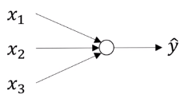
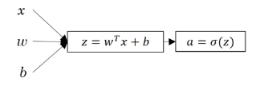
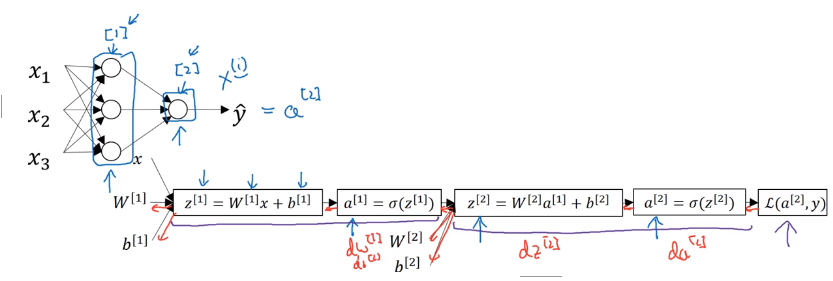
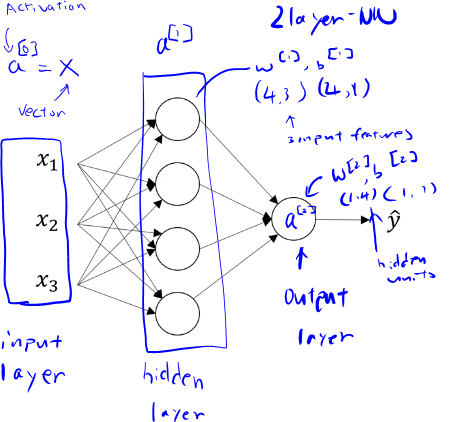
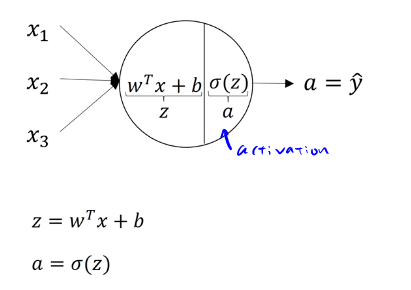
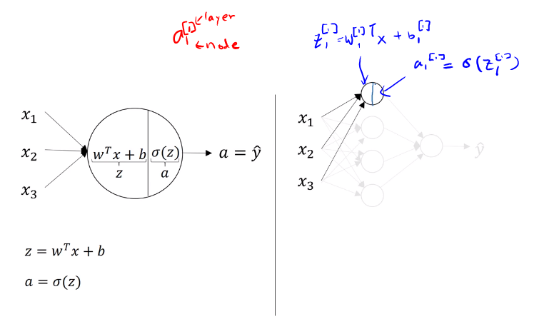
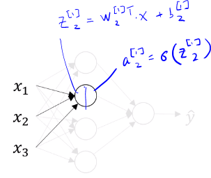
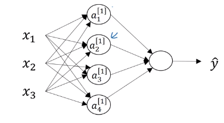
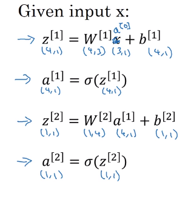

# Neural Networks Overview
<!-- TOC -->

- [Neural Networks Overview](#neural-networks-overview)
- [Neural Network Representation](#neural-network-representation)
- [Computing a Neural Network's Output](#computing-a-neural-networks-output)
  - [First node in the layer](#first-node-in-the-layer)
  - [Second node in the layer](#second-node-in-the-layer)
- [Vectorization](#vectorization)

<!-- /TOC -->
---
## Logistic Regression
Two steps computation given three samples (X), and parameters $w$ and $b$:
1. $z=w^{T}x+b$
2. $a=\sigma(z)$

## 2 layer neural network

* Square blacket refers to layer 1, 2 $\cdots$

# Neural Network Representation

The hidden layer can be written as
$$ a^{[1]}=\begin{bmatrix} a_1^{[1]} \\
a_2^{[1]} \\
a_3^{[1]} \\
a_4^{[1]} \\
\end{bmatrix}\tag 1$$
(4,1) matrix

# Computing a Neural Network's Output

## First node in the layer

## Second node in the layer

# Vectorization

### z and a computation of the hidden layer

$z_1^{[1]}=w{_1^{[1]}}^Tx+b_1^{[1]}$, $a_1^{[1]}=\sigma{(z_1^{[1]})}$

$z_2^{[1]}=w{_2^{[1]}}^Tx+b_2^{[1]}$, $a_2^{[1]}=\sigma{(z_2^{[1]})}$

$z_3^{[1]}=w{_3^{[1]}}^Tx+b_3^{[1]}$, $a_3^{[1]}=\sigma{(z_3^{[1]})}$

$z_4^{[1]}=w{_4^{[1]}}^Tx+b_4^{[1]}$, $a_4^{[1]}=\sigma{(z_4^{[1]})}$

### Stacking w vectors to form a matrix

$\begin{bmatrix}
 \text{-}  & w{_1^{[1]}}^T  & \text{-} \\
 \text{-}  & w{_2^{[1]}}^T  & \text{-} \\
 \text{-} & w{_3^{[1]}}^T  & \text{-} \\
 \text{-}  & w{_4^{[1]}}^T  & \text{-} \\
\end{bmatrix} \begin{bmatrix}
x_{1}\\
x_{2}\\
x_{3}
\end{bmatrix} +
\begin{bmatrix}
b_{1}\\
b_{2}\\
b_{3}\\
b_{4}
\end{bmatrix} =
\begin{bmatrix}
  w{_1^{[1]}}^Tx+b_1 \\
  w{_2^{[1]}}^Tx+b_2 \\
  w{_3^{[1]}}^Tx+b_3 \\
  w{_4^{[1]}}^Tx+b_4 \\
\end{bmatrix}$=$\begin{bmatrix}
z_1^{[1]}\\
z_2^{[1]}\\
z_3^{[1]}\\
z_4^{[1]}
\end{bmatrix}$

:arrow_up: (4,3) matrix. It needs to be multuplied by (3,1) matrix

Similary, activation can be represented as a vector where

$a^{[1]}=\begin{bmatrix}
a{_1^{[1]}}\\
a{_2^{[1]}}\\
a{_3^{[1]}}\\
a{_4^{[1]}}
\end{bmatrix} = \sigma{(z^{[1]})}$

