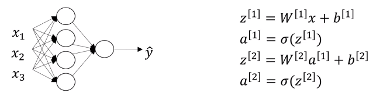

# Vectorizing across multiple examples

<!-- TOC depthFrom:1 depthTo:6 withLinks:1 updateOnSave:1 orderedList:0 -->

- [Vectorizing across multiple examples](#vectorizing-across-multiple-examples)
	- [For-loop approach](#for-loop-approach)
	- [vectorized implementation](#vectorized-implementation)
		- [A vector $X$](#a-vector-x)
		- [A vector $Z$](#a-vector-z)
		- [A vector $A$](#a-vector-a)
- [Justification for vectorized implementation](#justification-for-vectorized-implementation)

<!-- /TOC -->

## For-loop approach

If you have *m* training examples, in 2-layer NN, you will have

$x^{(1)} \to a^{[2](1)} =\hat{y}^{(1)}$

$x^{(2)} \to a^{[2](2)}  =\hat{y}^{(2)}$

$\vdots$

$x^{(m)} \to a^{[2](m)} =\hat{y}^{(m)}$

So if you are to do this in for-loop, you would write

for $i=1$ to $m$:

&ensp;&ensp;&ensp;$z^{[1](i)}=w^{[1]}x^{(i)}+b^{[1]}$

&ensp;&ensp;&ensp;$a^{[1](i)}=\sigma(z^{[1](i)})$

&ensp;&ensp;&ensp;$z^{[2](i)}=w^{[2]}x^{(1)}+b^{[2]}$

&ensp;&ensp;&ensp;$a^{[2](i)}=\sigma(z^{[2](i)})$

## vectorized implementation

### A vector $X$
Recall $X$ can be represented as a stacked columns of $x$ samples.

$$X=\begin{bmatrix}
|&|&&|\\
x^{(1)} &x^{(2)}& \cdots &x^{(m)} \\
|&|&&|\\
\end{bmatrix} \tag 1$$

(1) is a $(n_x,m)$ dimentional matrix. The **horizontal index** corresponds to different **training example**. The **vertical index** corresponds to different **features** in the neural network.

### A vector $Z$
$Z$ can be also represented as a stacked columns of $z$.
$$Z^{[1]}=\begin{bmatrix}
|&|&&|\\
z^{[1](1)} &z^{[1](2)}& \cdots &z^{[1](m)} \\
|&|&&|\\
\end{bmatrix} \tag 2$$
(2) is a $(n_x,m)$ dimentional matrix.
The **horizontal index** corresponds to different **training example**. The **vertical index** corresponds to different **nodes** in the neural network.
### A vector $A$

$A$ can be also represented as a stacked columns of $a$.
$$A^{[1]}=\begin{bmatrix}
|&|&&|\\
a^{[1](1)} &a^{[1](2)}& \cdots &a^{[1](m)} \\
|&|&&|\\
\end{bmatrix} \tag 3$$
(3) is a $(n_x,m)$ dimentional matrix.
The **horizontal index** corresponds to different **training example**. The **vertical index** corresponds to different **nodes** in the neural network.

So vectorizing implementation of neural network will be:

$Z^{[1]}=w^{[1]}X+b^{[1]} \tag 4$

$A^{[1]}=\sigma(Z^{[1]}) \tag5$

$Z^{[2]}=w^{[2]}A^{[1]}+b^{[2]}  \tag6$

$A^{[2]}=\sigma(Z^{[2]}) \tag7$

# Justification for vectorized implementation
