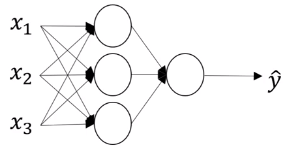
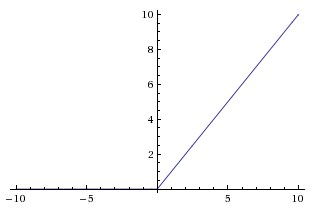
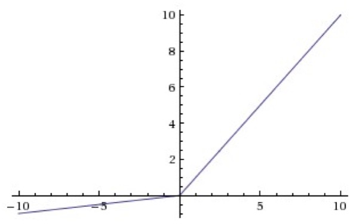

# Activation Functions (活性化関数)

<!-- TOC -->

- [Activation Functions (活性化関数)](#activation-functions-%E6%B4%BB%E6%80%A7%E5%8C%96%E9%96%A2%E6%95%B0)
  - [Sigmoid Activation Function (シグモイド関数)](#sigmoid-activation-function-%E3%82%B7%E3%82%B0%E3%83%A2%E3%82%A4%E3%83%89%E9%96%A2%E6%95%B0)
  - [Non Linear Activation Function](#non-linear-activation-function)
  - [tanh Activation Function](#tanh-activation-function)
  - [Rectify Linear Unit ランプ関数](#rectify-linear-unit-%E3%83%A9%E3%83%B3%E3%83%97%E9%96%A2%E6%95%B0)
  - [Leaky Rectify Linear Unit ランプ関数](#leaky-rectify-linear-unit-%E3%83%A9%E3%83%B3%E3%83%97%E9%96%A2%E6%95%B0)
  - [Rules of Thumb](#rules-of-thumb)
- [Why do we need non-linear activation functions?](#why-do-we-need-non-linear-activation-functions)

<!-- /TOC -->

## Sigmoid Activation Function (シグモイド関数)
Given x:

$z^{[1](i)}=w^{[1]}x^{(i)}+b^{[1]}$

$a^{[1](i)}=\sigma(z^{[1](i)})$

$z^{[2](i)}=w^{[2]}x^{(i)}+b^{[2]}$

$a^{[2](i)}=\sigma(z^{[2](i)})$

We used $\sigma$ function as an activation.

* The output is $0 <= \hat{y} <= 1$ so it can be used for binary classification.

$a=\frac{1}{1+e^{-z}}$

## Non Linear Activation Function

* $g$ could be a nonlinear function that may not be the sigmoid function.

$z^{[1](i)}=w^{[1]}x^{(i)}+b^{[1]}$

$a^{[1](i)}=g(z^{[1](i)})$

$z^{[2](i)}=w^{[2]}x^{(i)}+b^{[2]}$

$a^{[2](i)}=g(z^{[2](i)})$

## tanh Activation Function
1990年代になり、活性化関数は原点を通すべきと言う考えから、標準シグモイド関数よりもそれを線形変換した tanh の方が良いと提案された Yann LeCun; Leon Bottou; Genevieve B. Orr; Klaus-Robert Muller (1998). [Efficient BackProp](http://yann.lecun.com/exdb/publis/pdf/lecun-98b.pdf)

$a=tanh(z)=\frac{e^z-e^{-z}}{e^z+e^{-z}}$

* This is a shifted version of sigmoid function
* The curve crosses (0,0) and the values are between -1 and 1.
* The output is $-1 <= \hat{y} <= 1$ and the tanh function is almost always strictly superior.
* One of the **downsides** of both the sigmoid function and the tanh function is that if z is either very large or very small, then the gradient or the **derivative of this function becomes very small**.

## Rectify Linear Unit ランプ関数
Yann LeCun やジェフリー・ヒントンらが雑誌ネイチャーに書いた論文では、2015年5月現在これが最善であるとしている。 Yann LeCun; Yoshua Bengio; Geoffrey Hinton (May 28, 2015). “Deep learning”. Nature 521 (7553): 436-444. [doi:10.1038/nature14539](https://doi.org/10.1038%2Fnature14539)

$a=max(0,z)$

## Leaky Rectify Linear Unit ランプ関数

$a=max(0.01z, z)$

Andrew L. Maas; Awni Y. Hannun; Andrew Y. Ng (2013). [Rectifier Nonlinearities Improve Neural Network Acoustic Models](http://web.stanford.edu/~awni/papers/relu_hybrid_icml2013_final.pdf)
## Rules of Thumb

Activation function |Formula|Type of classification   |
--|---|---
$\sigma(z)$  | $\frac{1}{1+e^{-z}}$ |binary classification
$tanh(z)$  |  $\frac{e^{z}-e^{-z}}{e^{z}+e^{-z}}$
ReLU(z)  |max(0,z)|Default
Leaky ReLU(z)  |max(0.01z, z)|Works better than ReLU

* Your neural network will often learn much faster with ReLU and Leaky ReLU activation than when using the tanh or the sigmoid activation function

# Why do we need non-linear activation functions?

LEt's eliminate non-linear function from the formulas above:
use linear activation function: $g(z)=z$

$z^{[1](i)}=w^{[1]}x^{(i)}+b^{[1]}$

$a^{[1](i)}=z^{[1](i)}$

$z^{[2](i)}=w^{[2]}x^{(i)}+b^{[2]}$

$a^{[2](i)}=z^{[2](i)}$

So,

$a^{[1]}=z^{[1]}=w^{[1]}x+b^{[1]}$

$a^{[2]}=z^{[2]}=w^{[2]}a^{[1]}+b^{[2]}$

&nbsp;&nbsp;&nbsp;&nbsp;&nbsp;&nbsp;&nbsp;&nbsp;$=w^{[2]}(w^{[1]}x+b^{[1]})+b^{[2]}$

&nbsp;&nbsp;&nbsp;&nbsp;&nbsp;&nbsp;&nbsp;&nbsp;$=w^{[2]}(w^{[1]}x+b^{[1]})+b^{[2]}$

&nbsp;&nbsp;&nbsp;&nbsp;&nbsp;&nbsp;&nbsp;&nbsp;$=(w^{[2]}w^{[1]})x+(w^{[2]}b^{[1]}+b^{[2]})$

&nbsp;&nbsp;&nbsp;&nbsp;&nbsp;&nbsp;&nbsp;&nbsp;$=w'x + b'$

If activation function is a linear function, then the output is also the linear function. So if you have a deep neural network without an activation function (with a linear activation function), it is just computing the linear activation function repeadetly. The linear functions in the hidden units are **useless**.

* For regression problem in machine learning, you use a linear function for the output layer since $y \in \mathbb{R}$, but the hidden layer should use the non-linear activation function such as ReLU and tanh.
