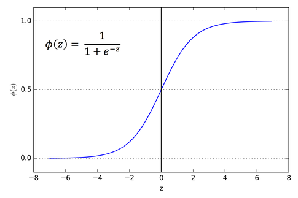
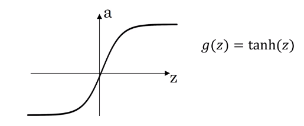
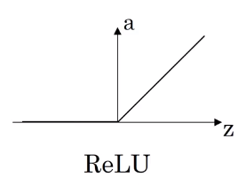
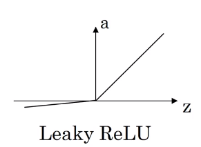

# Derivatives of activation functions

## Derivatives of sigmoid activation functions

If $g(z)=\frac{1}{1+e^{-z}}$ then $\frac{d}{dz}g(z)$ is a slope of $g(x)$ at $z$. The derivative of g as relates to z is often described as **g prime of z** i.e. $g'(z)$.

$\begin{align}
g'^{(z)}=\frac{d}{dz}g(z)&= \frac{1}{1+e^{-z}}(1-\frac{1}{1+e^{-z}})\\
&=g(z)(1-g(z))\end{align}$

* If $z$ is very large then $g(z)\approx 1$, so $g'^{(z)}=\frac{d}{dz}g(z)\approx 0$

* If $z$ is very small then $g(z)\approx 0$, so $g'^{(z)}=\frac{d}{dz}g(z)\approx 0$

* If $z=0$  then $g(z)=\frac{1}{2}$, so $g'^{(z)}=\frac{d}{dz}g(z)=\frac{1}{4}$

* In neural network, $a=g(z)=\frac{1}{1+e^{-z}}$, so $g'^{(z)}=a(1-a)$

## Derivatives of Tanh activation Functions

If $g(z)=\frac{e^{z}-e^{-z}}{e^{z}+e^{-z}}$ then $\frac{d}{dz}g(z)=g'^{(z)}$ is a slope of $g(x)$ at $z$.

$g'(z)=1-(tanh(z))^2$

* If $z$ is very large then $g(z)\approx 1$, so $g'^{(z)}=\frac{d}{dz}g(z)\approx 0$

* If $z$ is very small then $g(z)\approx -1$, so $g'^{(z)}=\frac{d}{dz}g(z)\approx 0$

* If $z=0$  then $g(z)=0$, so $g'^{(z)}=\frac{d}{dz}g(z)=1$

* In neural network, $a=g(z)$, so $g'^{(z)}=1-a^2$

## Derivatives of ReLU and Leaky Relu activation Functions
### Derivatives of ReLU

$g(z)=max(0,z)$

$g'(z)=\begin{cases}
0, \text{ if } z<0\\
1, \text{ if } z>0\\
\text{undefined, if }z=0
\end{cases}$

but practically people implement
$g'(z)=\begin{cases}
0, \text{ if } z<0\\
1, \text{ if } z>0\\
\end{cases}$

### Derivatives of Leaky ReLU

$g(z)=max(0.01z,z)$

$g'(z)=\begin{cases}
0.01, \text{ if } z<0\\
1, \text{ if } z>0\\
\text{undefined, if }z=0
\end{cases}$

but practically people implement
$g'(z)=\begin{cases}
0.01, \text{ if } z<0\\
1, \text{ if } z>0\\
\end{cases}$
