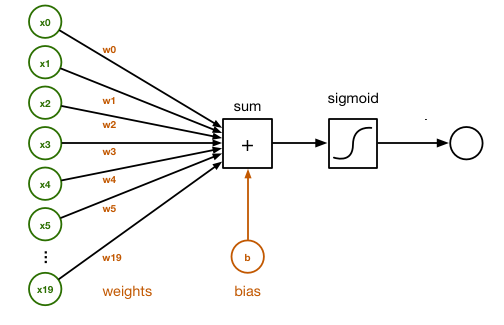

# Gradient Descent for Neural networks

<!-- TOC -->

- [Gradient Descent for Neural networks](#gradient-descent-for-neural-networks)
  - [Parameters](#parameters)
  - [Cost function](#cost-function)
  - [Gradient descent](#gradient-descent)
  - [Formula for computing Derivatives](#formula-for-computing-derivatives)
    - [Forward propagation:](#forward-propagation)
    - [Backpropagation (Compute Derivatives):](#backpropagation-compute-derivatives)
- [Backpropagation Intuition](#backpropagation-intuition)
  - [Logistic Regression](#logistic-regression)
  - [Neural Network](#neural-network)
    - [Dimentions](#dimentions)
    - [Summary of gradient Descent](#summary-of-gradient-descent)
      - [Vectorized Implementation](#vectorized-implementation)

<!-- /TOC -->
## Parameters
Parameters for a single layer neural network: $w^{[1]}$, $b^{[1]}$,  $w^{[2]}$, $b^{[2]}$

If
* $n_x=n^{[0]}$ input features ,
* $n^{[1]}$ Hidden units,
* $n^{[2]}=1$ Output units$:

* Matrix of $w^{[1]}$ is $(n^{[1]}, n^{[0]})$,
* Matrix of $b^{[1]}$ is $(n^{[1]}, 1)$,
* Matrix of $w^{[2]}$ is $(n^{[2]}, n^{[1]})$,
* Matrix of $b^{[2]}$ is $(n^{[2]}, 1)$,

## Cost function
$J(w^{[1]}, b^{[1]},  w^{[2]}, b^{[2]})=\frac{1}{m}L(\hat{y},y)$

where $\hat{y}=a^{[2]}$

## Gradient descent
 To train the algorithm, you need to compute gradient descent. When you are training a neural network it is important to initialize the parameters randomly rounded into all zeros.

Repeat
$\begin{cases}
\text{Compute predictions: }(\hat{y}^{(i)}, i=1, \cdots ,m)\\
\text{Compute derivative: }dw^{[1]}=\frac{\partial \mathcal{J}}{\partial w^{[1]}}, db^{[1]}=\frac{\partial \mathcal{J}}{\partial b^{[1]}}, dw^{[2]}=\frac{\partial \mathcal{J}}{\partial w^{[2]}}, db^{[2]}=\frac{\partial \mathcal{J}}{\partial  b^{[2]}}, \\
\text{Update parameter: }w^{[1]}=w^{[1]} -\alpha{w^{[1]}}\\
\text{Update parameter: }b^{[1]}=b^{[1]} -\alpha{b^{[1]}}\\
\text{Update parameter: }w^{[2]}=w^{[2]} -\alpha{w^{[2]}}\\
\text{Update parameter: }b^{[2]}=b^{[2]} -\alpha{b^{[2]}}
\end{cases}$

## Formula for computing Derivatives

### Forward propagation:

$Z^{[1]}=W^{[1]}X+b^{[1]}$

$A^{[1]}=g^{[1]}(Z^{[1]})$

$Z^{[2]}=W^{[2]}A^{[1]}+b^{[2]}$

$A^{[2]}=g^{[2]}(Z^{[2]})$

### Backpropagation (Compute Derivatives):
$\begin{align}
&dZ^{[2]}=A^{[2]}-Y\text{ where } Y=[y^{(1)},y^{(2)},\cdots, y^{(m)}] \tag1\\
&dw^{[2]}=\frac{1}{m}*dZ^{[2]}A^{[1]T} \tag2\\
&db^{[2]}= \underbrace{\frac{1}{m}*np.sum(dZ^{[2]}, axis=1, keepdims=True)}_{\text{keepdims option will ensure that the output is a matrix of }{(n^{[2]},1)}} \tag3\\
&dZ^{[1]}=\underbrace{W^{[2]T}dZ^{[2]}}_{(n^{[1]}, m)}\underbrace{*}_{\text{elementwise product}}\underbrace{g^{[1]}(z^{[1]})}_{({m^{[1]},m}) \tag4}\\
&dW^{[1]}=\frac{1}{m}*dZ^{[1]}X^T \tag5\\
&db^{[1]}=(1/m)*np.sum(dZ^{[1]}, axis=1, keepdims=True) \tag6\\
\end{align}$

# Backpropagation Intuition
## Logistic Regression

$\begin{matrix}
x\\
& \searrow\nwarrow\\
w &\xrightarrow{} & z=w^Tx+b & \rightleftarrows  & a=\sigma(z)& \rightleftarrows  L(a,y)\\
&\swarrow\nearrow& \downarrow && \downarrow & \\
b  && dz&&da \\
&dw\\
& db
\end{matrix}$

$\begin{align}da=\frac{d}{da}L(a,y)&=-y\log a - (1-y)log(1-a) \tag7\\
&=-\frac{y}{a}+\frac{1-y}{1-a}\tag8
\end{align}$
* $dz=a-y$

Based on chain rule,
$dz=da\cdot g'(z)$.

$g(z)=\sigma(z)$, $dw=dz\cdot x$, $db=dz$ if there is single training example.

## Neural Network

$\begin{matrix}
 & & &  & & w^{[2]}\searrow\nwarrow dW^{[2]}\\
x & & &  & & b^{[2]}\searrow\nwarrow db^{[2]}\\
& \searrow\nwarrow\\
W^{[1]} &\xrightarrow{} & z^{[1]}=W^{[1]}x+b^{[1]} & \rightleftarrows  & a^{[1]}=\sigma(z^{[1]})& \rightleftarrows &z^{[2]}=W^{[2]}x+b^{[2]}& \rightleftarrows & a^{[2]}=\sigma(z^{[2]}) &\rightleftarrows & L(a^{[2]},y)\\
&\swarrow\nearrow& \downarrow && \downarrow & \\
b^{[1]}  && dz^{[1]} &&da^{[1]}&& dz^{[2]} &&da^{[2]} \\
&dW\\
& db
\end{matrix}$

* $dz^{[2]}=a^{[2]}-y$
* $dW^{[2]}=dz^{[2]}a^{[1]T}$
* $db^{[2]}=dz^{[2]}$
* $dz^{[1]}=W^{[2]T}dz^{[2]}g{[1]}'(z^{[1]})$
* $dW^{[1]}=dz^{[1]}x^T$ note $x^T=a^{[0]T}$
* $db^{[1]}=dz^{[1]}$

### Dimentions
* x1, x2, x3 ,... has $n_x=n^{[0]}$ dimentional shape
* the hidden layer has $n^{[1]}$ dimentional shape
* the output layer $n^{[2]}=1$ dimentional shape

so, the shape of $W^{[2]}=(n^{[2]},n^{[1]})$,

The shape of $z^{[2]}$ and $dz^{[2]}$ are $(n^{[2]},1)$

The shape of $z^{[1]}$ and $dz^{[1]}$ are $(n^{[1]},1)$

$W^{[i]}=\begin{bmatrix}-----\end{bmatrix}$
$z^{[i]}=\begin{bmatrix}-\\-\\-\\-\\-\end{bmatrix}$

### Summary of gradient Descent

#### Vectorized Implementation

#####Forward propagation
$z^{[1]}=W^{[1]}x + b^{[1]}$

$a^{[1]}=g^{[1]}(z^{[1]})$

* To make a matrix, take each element and stacked them up in columns like
$Z^{[1]}=\begin{bmatrix}
|&|& &|&\\
z^{[1](1)}&z^{[1](2)}& \cdots &z^{[1](m)}\\
|&|& &|&\\
\end{bmatrix}$

We do this for other elements and you will have:

$Z^{[1]}=W^{[1]}X + b^{[1]}$

$A^{[1]}=g^{[1]}(Z^{[1]})$

#####Backward propagation
$\begin{align}
 &dz^{[2]}=a^{[2]}-y        &&dZ^{[2]}=A^{[2]}-Y\\
 &dW^{[2]}=dz^{[2]}a^{[1]T} &&dW^{[2]}=\frac{1}{m}*dZ^{[2]}A^{[1]T}\\
 &db^{[2]}=dz^{[2]}         &&db^{[2]}=\color{blue}{\frac{1}{m}*np.sum(dZ^{[2]}, axis=1, keepdims=True)}\\
 &\underbrace{dz^{[1]}}_{\color{blue}{(n^{[1]},1)}}=W^{[2]T}dz^{[2]}g{[1]}'(z^{[1]})&&\underbrace{dZ^{[1]}}_{\color{blue}{(n^{[1]}, m)}}=\underbrace{W^{[2]T}dZ^{[2]}}_{\color{blue}{(n^{[1]}, m)}}\overbrace{*}^{\color{blue}{\text{elementwise product}}}\underbrace{g{[1]}'(Z^{[1]})}_{\color{blue}{(n^{[1]}, m)}}\\
  &dW^{[1]}=dz^{[1]}x^T&&dW^{[1]}=\frac{1}{m}*dZ^{[1]}X^T\\
 &db^{[1]}=dz^{[1]}&&db^{[1]}=\color{blue}{\frac{1}{m}*np.sum(dZ^{[1]}, axis=1, keepdims=True)}
\end{align}$
