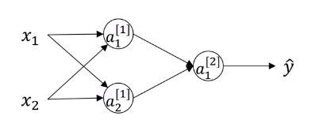

# Random Initialization

When you change your neural network, it's important to initialize the weights randomly. For logistic regression, it was okay to initialize the weights to zero. But for a neural network of initialize the weights to parameters to all zero and then applied gradient descent, it won't work.


$\begin{matrix}n^{[0]}=2&&&n^{[1]}=2\\
\color{blue}{\text{input}}&&&\color{blue}{\text{hidden layer}}\\
\end{matrix}$

So, $W^{[1]}$ is a (2,2) matrix and initialize it as $W^{[1]}=\begin{bmatrix}0&0\\0&0\end{bmatrix}$ and $b^{[1]}=\begin{bmatrix}0\\0\end{bmatrix}$.
Initializing $W^{[1]}$ to 0 is a problem, but initializing $b^{[1]}$ to 0 is ok. If $W^{[1]}$ is 0, then $a_1^{[1]}=a_2^{[1]}$ because both of these hidden units are computing exactly the same function. Furthermore, in the backward propagation, $dz_1^{[1]}=dz_2^{[1]}$ and $w^{[2]}=\begin{bmatrix}0&0\end{bmatrix}$.

So when a weight gets updated, $W^{[1]}=W^{[1]}-\alpha{dW}$ and after every iteration,  $W^{[1]}$ will have the first row equal to the second row. So it's possible to construct a proof by induction that if you initialize all the ways, all the values of w to 0, then because both hidden units start off computing the same function. And both hidden units have the same influence on the output unit, then after one iteration, that same statement is still true, the two hidden units are still symmetric. And therefore, by induction, after two iterations, three iterations and so on, no matter how long you train your neural network, both hidden units are still computing exactly the same function. And so in this case, there's really no point to having more than one hidden unit. 

Solution to this problem is to use a small random numbers for initializing parameters.

`numpy.random.randn(d0, d1, …, dn)` creates an array of specified shape and fills it with random values as per standard normal distribution.

```Python
W1=np.random.randn((2,2))*0.01
b1=np.zeros((2,1))
W2=np.random.randn((1,2))*0.01
b2=0
```

Similarly, for $W^{[2]}$, you're going to initialize that randomly. And $b^{[2]}$, you can initialize that to 0.

$\color{blue}{\text{Usually, a random numbers in an array is multiplied by a very small number,}}$ because if $W^{[1]}$ is large, then $Z^{[1]}=W^{[1]}x+b^{[1]}$ is also large, and $a^{[1]}=g^{[1]}(Z^{[1]})$ is also large so the learning rate speed becomes very slow. Constant of 0.01 should be okay for sharrow neural network.
