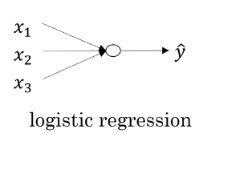
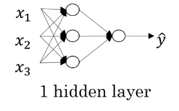
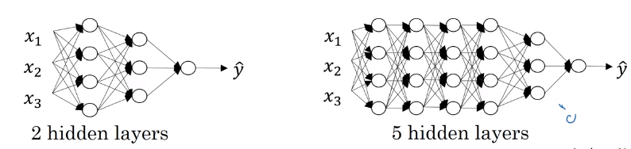
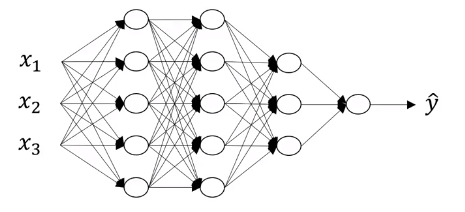

# Deep L-layer neural network

## What is a deep neural network

Technically logistic regression is a one layer neural network, but over the last several years the AI, on the machine learning community, has realized that there are functions that very deep neural networks can learn that shallower models are often unable to. Although for any given problem, it might be hard to predict in advance exactly how deep in your network you would want. So it would be reasonable to try logistic regression, try one and then two hidden layers, and view the number of hidden layers as another hyper parameter that you could try a variety of values of, and evaluate on all that across validation data, or on your development set. 

## Notations

4-layer neural network

* $L$: Number of layers
* $n^{[l]}$: Number of units in layer $l$
* $a^{[l]}$: Activation in layer $l$, so $a^{[l]}=g^{[l]}(z^{[l]})$
* $w^{[l]}$: Weight for $z^{[l]}$
* $b^{[l]}$: Weight for $z^{[l]}$
* $x=a^{[l]}$
* $\hat{y}=a^{[L]}$
*
$L$=4, $n^{[0]}$=$n_x$=3,  $n^{[1]}$=5 , $n^{[2]}$=5, $n^{[3]}$=3, $n^{[4]}$=1
