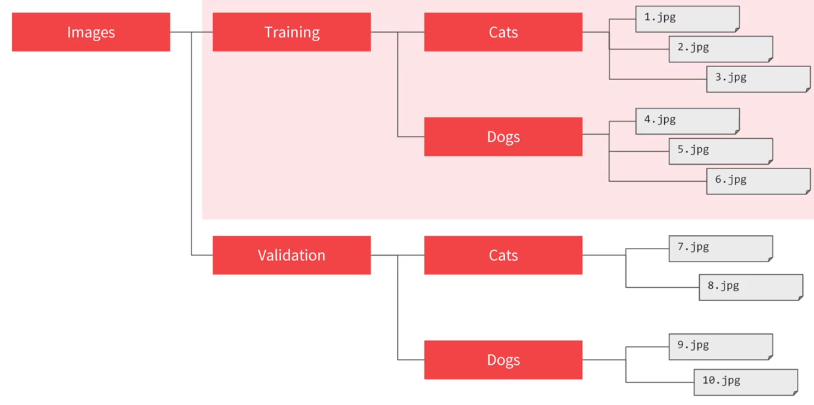
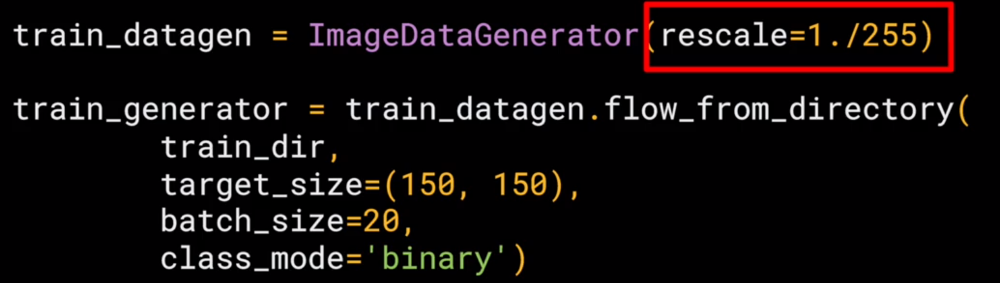
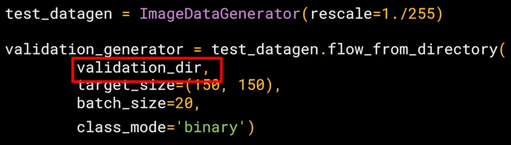
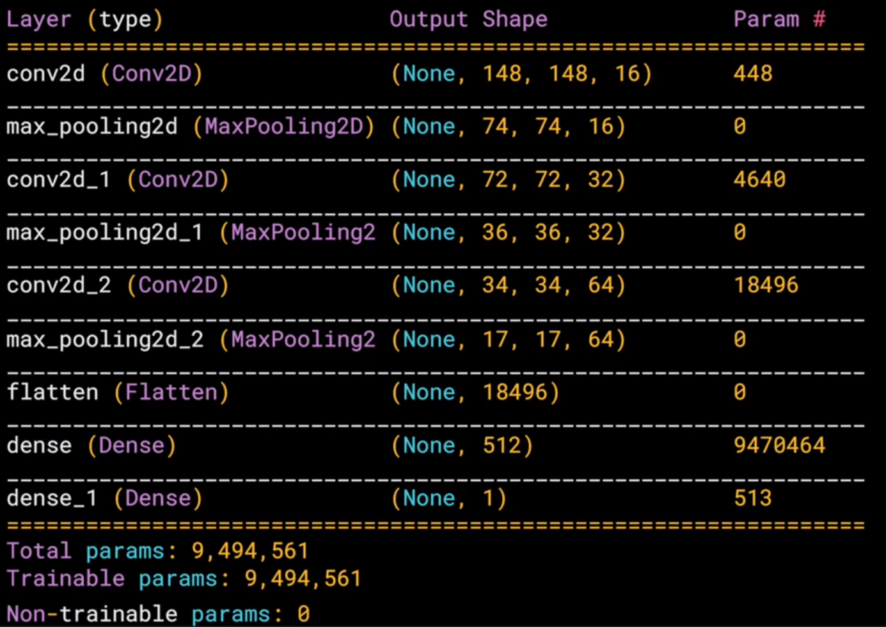
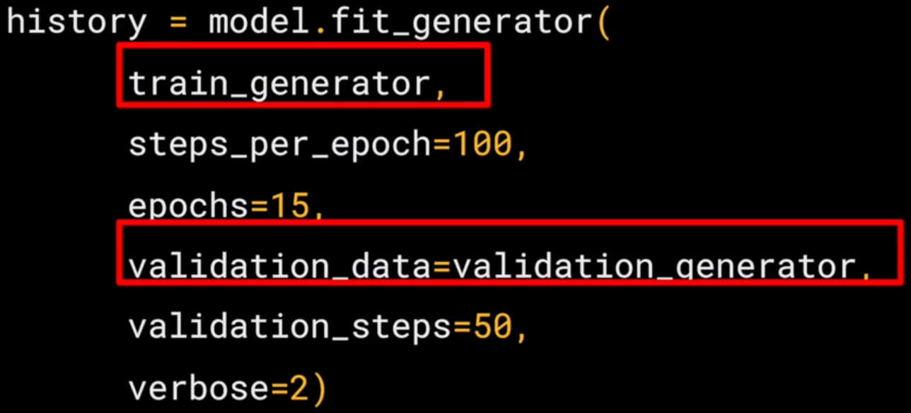

# Training with the cats vs. dogs dataset

Revisiting the famous Kaggle Dogs v Cats dataset: https://www.kaggle.com/c/dogs-vs-cats.

This was originally a challenge in building a classifier aimed at the world's best Machine Learning and AI Practitioners, but the technology has advanced so quickly, you'll see how you can do it in just a few minutes with some simple Convolutional Neural Network programming.

## Labeling Job
TF allows easy labeling for iamges by organizing the pictures into the folders.

'ImageDataGenerator' in TF is the one often used to generate labels by how the pictures are organized.

## Training

- `rescale=1./255` to normalize the data
- `flow_from_directory` to generate labels from the folders
- `targe_size` is the target image size.

## Validation

## Model Architecture

## Model summary

## Model fitting

[Notebook](python-examples/cat-vs-dog.ipynb)
