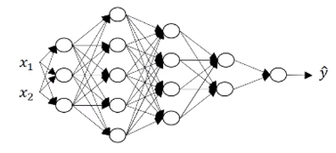
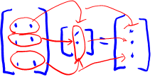
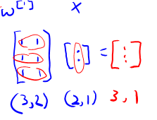
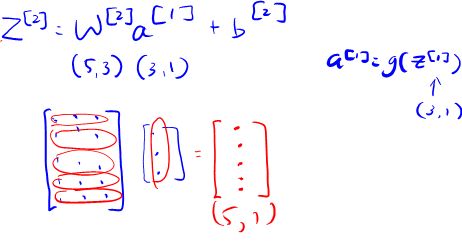

# Getting your matrix dimensions right

$L=5$ for above neural network.

* The first step in implementing a forward propagation is $z^{[1]}=w^{[1]}x +b^{[1]}$. For this illustration, we assume $b^{[1]}=0$.

## 1 - Number of x and hidden units
* $n^{[0]}=2$.
* For $l=1$, there is 3 hidden units ($n^{[1]}=3$).
* For $l=2$, there is 5 hidden units ($n^{[2]}=5$).
* For $l=3$, $n^{[3]}=4$.
* For $l=4$, $n^{[4]}=2$.
* For $l=5$, $n^{[5]}=1$.

## 2 - Non-vectorized Implementations

### 2.1 - Dimentions of $z$ and parameter $w$

$\begin{matrix}\underbrace{z^{[1]}}_{}&=&w^{[1]}&x& +b^{[1]}\\
(3,1)&&(3,2)&(2,1)\\
(n^{[1]},1)&&(n^{[1]},n^{[0]})&(n^{[0]},1)
\end{matrix}$

**Patterns**

$w^{[1]}:$ $(n^{[1]},n^{[0]})$

$w^{[2]}:$ $(n^{[2]},n^{[1]})=(5,3)$

$z^{[1]}=w^{[1]}x$ when $b^{[1]}=0$

$\begin{matrix}\underbrace{z^{[2]}}_{}&=&w^{[2]}&a^{[1]}& +b^{[2]}\\
(5,1)&&(5,3)&(3,1)\\
(n^{[2]},1)&&(n^{[2]},n^{[1]})&(n^{[1]},1)
\end{matrix}$

$\begin{matrix}\underbrace{z^{[3]}}_{}&=&w^{[3]}&a^{[2]}& +b^{[3]}\\
(4,1)&&(4,5)&(5,1)\\
(n^{[3]},1)&&(n^{[3]},n^{[2]})&(n^{[2]},1)
\end{matrix}$

$w^{[4]}$: (2,4)

$w^{[5]}$: (1,2)

**Formula to check the dimensions of parameter w**,

$$w^{[l]}:(n^{[l]},n^{[l-1]}) \tag1$$

### 2.2 - Dimentions of parameter $b$

$w^{[1]}x$ is a (3,1) vector, so $b^{[1]}$ has to be a (3,1) vector

$\begin{matrix}\underbrace{z^{[1]}}_{}&=&w^{[1]}&x& +b^{[1]}\\
(3,1)&&(3,2)&(2,1)&(3,1)\\
(n^{[1]},1)&&(n^{[1]},n^{[0]})&(n^{[0]},1)
\end{matrix}$

**General rules are**

$b^{[1]}: (n^{[1]},1)$

so **Formula to check the dimensions of parameter b**,

$$b^{[l]}:(n^{[l]},1) \tag2$$

### 2.3 - Dimentions of dw and db

$$dw^{[l]}:(n^{[l]},n^{[l-1]}) \tag3$$

$$db^{[l]}:(n^{[l]},1) \tag4$$

### 2.4 - Dimention of $a^{[l]}$

Since $z^{[l]}=g^{[l]}(a^{[l]})$ so the dimensions of $z^{[l]}$ and $a^{[l]}$ are the same.

$\begin{matrix}\underbrace{z^{[1]}}_{}&=&\underbrace{w^{[1]}}&\underbrace{x}& +\underbrace{b^{[1]}}\\
(n^{[1]},1)&&(n^{[1]},n^{[0]})&(n^{[0]},1)&(n^{[1]},1)
\end{matrix}$

## 3 - Vectorized Implementations

### 3.1 - Non vectorized
$\begin{matrix}\underbrace{z^{[1]}}_{}&=&\underbrace{w^{[1]}}&\underbrace{x}& +\underbrace{b^{[1]}}\\
(n^{[1]},1)&&(n^{[1]},n^{[0]})&(n^{[0]},1)&(n^{[1]},1)
\end{matrix}$

Dimentions of $\color{blue}{z^{[1]}}$, $\color{blue}{a^{[1]}}$: $\color{blue}{(n^{[l]},1)}$

### 3.2 - Vectorized
$\begin{matrix}\underbrace{Z^{[1]}}_{}&=&\underbrace{w^{[1]}}&\underbrace{X}& +\underbrace{b^{[1]}}\\
(n^{[1]},m)&&(n^{[1]},n^{[0]})&(n^{[0]},m)&(n^{[1]},1)\to (n^{[1]},m)
\end{matrix}$

Since
$Z^{[1]}=\begin{bmatrix}
|&|&&|\\
z^{[1](1)} &z^{[1](2)}& \cdots &z^{[1](m)} \\
|&|&&|\\
\end{bmatrix}$ so the dimension is $(n^{[1]},m)$

Since
$X=\begin{bmatrix}
|&|&&|\\
x^{(1)} &x^{(2)}& \cdots &x^{(m)} \\
|&|&&|\\
\end{bmatrix} =A^{[0]}$, so the dimension is $(n^{[0]},m)$

$b^{[1]}$ is still $(n^{[1]},1)$ but python will broadcast it to $(n^{[1]},m)$

Dimentions of $\color{blue}{Z^{[1]}}$, $\color{blue}{A^{[1]}}$: $\color{blue}{(n^{[l]},m)}$

Dimentions of $\color{blue}{dZ^{[1]}}$, $\color{blue}{dA^{[1]}}$: $\color{blue}{(n^{[l]},m)}$
