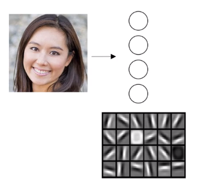
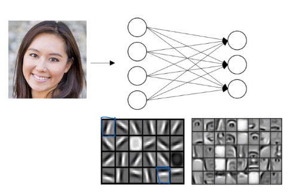
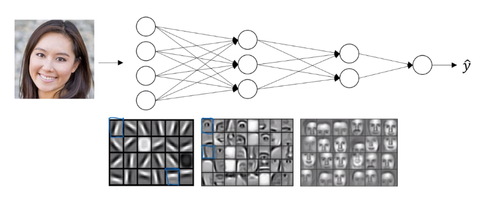

# Why deep network representations?

## 1 - Intuition about deep representation

1. The first layer of the neural network is try to figure out where are the edges in the picture. The earlier layers of the neural network as detecting simple functions, like edges. ALso, the edge detector is looking at very small area of the pictures.

2. Then think about where the edges in this picture by grouping together pixels to form edges. It can then de-detect the edges and group edges together to form parts of faces. We might have a low neuron trying to see if it's finding an eye, or a different neuron trying to find that part of the nose.  By putting together lots of edges, it can start to detect different parts of faces.

3. Finally, by putting together different parts of faces, like an eye or a nose or an ear or a chin, it can then try to recognize or detect different types of faces. The later layers are looking at more bigger area of the pictures.

 This type of simple to complex hierarchical representation, or compositional representation, applies in other types of data than images and face recognition as well. For example, if we're trying to build a speech recognition system, it's hard to revisualize speech but if we input an audio clip then maybe the first level of a neural network might learnt to detect low level audio wave form features, such as is this toe going up?

 The deep neural networks work well as they start with relatively simple functions of the input such as right at the edges, and by the time we get deep in the network we can actually do surprisingly complex things.

 ## 2 - Circuit theory and deep Learning

Informally: THere are functions you can compute with a 'small' L-layer deep neural network that shallower networks require exponentially more hidden units to compute.

* Number of layers - order of ($\log_n$) -
* Number of hidden units in a single layer $\approx 2^{{n-1}}$

mathmatically easier to compute deeper network than the sharrow network
