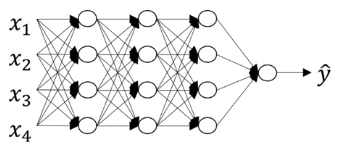
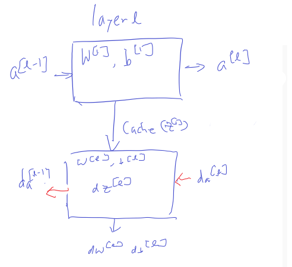
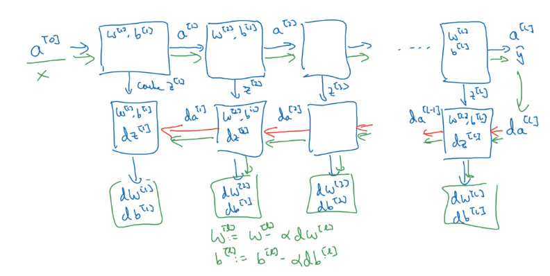

# Building blocks of deep neural networks

Layer $l$: $w^{[l]}$, $b^{[l]}$

$\color{blue}{\text{Forward: Input }} a^{[l-1]}\color{blue}{\text{, Output }}a^{[l]}$

$\color{green}{z^{[l]} : w^{[l]}a^{[l-1]}+b}$ $\color{blue}{\text{cache: } z^{[l]}}$

$\color{green}{a^{[l]} : g(z^{[l]})}$

$\begin{matrix}\color{blue}{\text{Backward: Input }} &da^{[l]}&\color{blue}{\text{ Output }}&da^{[l-1]}\\
&cache(z^{[l]})&&dw^{[l]}\\
&&&db^{[l]}\end{matrix}$

Forward and backward functions

