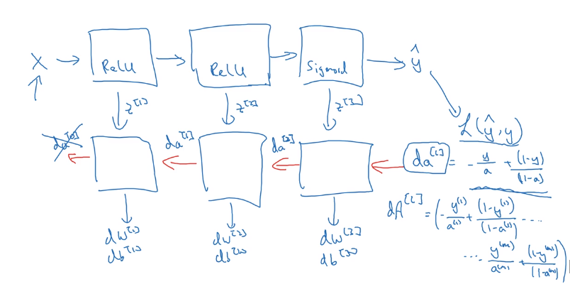

# Forward and Backward propagation
## Forwared propagation for layer $l$

* Input $a^{[l-1]}$
* Output $a^{[l]}$, cache $(z^{[l]})$ $w^{[l]}, b^{[l]}, a^{[l-1]}$

$\begin{matrix}
\text{non-vectorized implementation}&&\text{vectorized implementation}\\
z^{[l]}=w^{[l]}a^{[l-1]}+b^{[l]} & & Z^{[l]}=w^{[l]}A^{[l]}+b^{[l]}\\
a^{[l]}=g^{[l]}(z^{[l]})& & A^{[l]}=g^{[l]}(Z^{[l]})
\end{matrix}$

## Backward propagation for layer $l$

* Input $da^{[l]}$
* Output $da^{[l-1]}$, $dw^{[l]}$, $db^{[l]}$

$\begin{matrix}
\text{non-vectorized implementation}&&\text{vectorized implementation}\\
dz^{[l]}=da^{[l]}*g^{[l]\prime}(z^{[l]}) & & dZ^{[l]}=dA^{[l]}*g^{[l]\prime}(Z^{[l]})\\
dw^{[l]}=dz^{[l]}(a^{[l-1]})& & dw^{[l]}=\frac{1}{m}dZ^{[l]}(A^{[l-1]T})\\
db^{[l]}=dz^{[l]} && db^{[l]}=\frac{1}{m}np.sum(dZ^{[l]},axis=1,keepdims=True) \\
da^{[l-1]}=w^{[l]T}dz^{[l]}&&dA^{[l-1]}=w^{[l]T}dZ^{[l]}
\end{matrix}$

