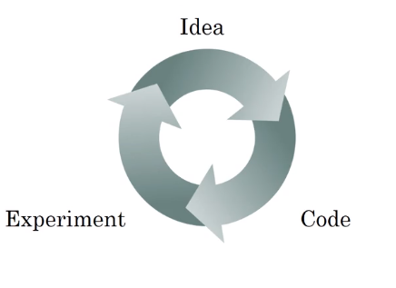
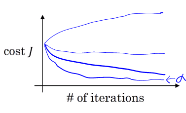

# Parameters vs hyperparameters
## What are hyperparameters?

Parameters: $W^{[1]}, b^{[1]}, W^{[2]}, b^{[2]}, W^{[3]}, b^{[3]}, \dots$

Hyperparameters:

* Learning rate - $\alpha$
* Number of iterations of gradient descent
* Number of hidden layer - $L$
* Number of hidden units - $n^{[1]}, n^{[2]}, \cdots$
* Choice of activation functions

These hyperparameters controlles parameters $W$ and $b$.

Other hyperparameters including, momentum, mini batch size, various forms of regularizations

## Applied deep learning is a very empirical process

We might have the best idea of $\alpha$ and may start with 0.01 for example and adjust it to 0.05.

May need to try couple learning rates to find the pretty fast learning and converge to a lower cost function.

* You may have to try many iterations to find out the best Hyperparameters
