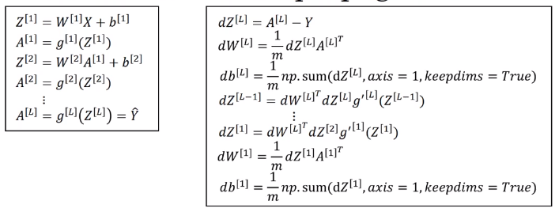
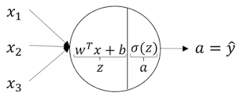
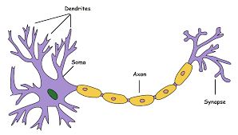

# What does this have to do with the brain?

Why people keep making the analogy between deep learning and the human brain?

Similarity in a single logistic regression unit and human neurons

Today even neuroscientists have almost no idea what even a single neuron is doing. A single neuron appears to be much more complex than we are able to characterize with neuroscience and while some of what is doing is a little bit like logistic regression, there's still a lot about what even a single neuron does that no one there no human today understands. For example exactly how neurons in the human brain learn this is still a very mysterious process, and it's completely unclear today whether the human brain uses an algorithm does anything like back propagation or gradient descent or if there's some fundamentally different learning principle that the human brain uses. 
