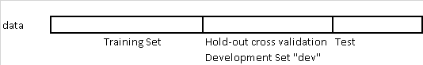
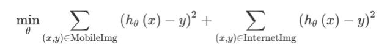
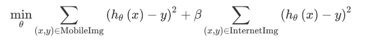

# Train / Dev / Test sets

## Applied machine learning is a highly iterative process

- number of layers
- number of hidden units
- learning rate
- activation Functions

Idea -> Code -> Experiment -> Idea -> Code ...

## Train/dev/test sets

Traditionally until a few years ago:
- 70% Training 30% test
- 60 % Training, 20 % hold-out, 20% Test (60/20/20)

When the records are 100, 1000, or 10000.

* For big data era, (>1,000,000 records)
    * 10,000 records for 'dev' would be enough
    * 10,000 records for 'test' would be enough
  98%/1%/1%

## Mismatched train/test distributions
* In the era of modern deep learning is that more and more people train on mismatched train and test distributions

For example:

* Training set could come from cat pictures from webpages
* Dev, Test sets could come from cat pictures from users using your app.

> **Rule of thumbs**: Make sure dev and test come from same distribution.
* Not having a test set might be okay with only dev set -  the goal of the test set is to give an unbiased estimate of the performance of the final network. But if we don't need that unbiased estimate, then it might be okay to not have a test set.

## When you should train and test on different distributions

Users of your cat pictures app have uploaded 10,000 images, which you have manually labeled as containing cats or not. You also have a larger set of 200,000 images that you downloaded off the internet. How should you define train/dev/test sets?

Since the 10,000 user images closely reflect the actual probability distribution of data you want to do well on, you might use that for your dev and test sets. If you are training a data-hungry deep learning algorithm, you might give it the additional 200,000 internet images for training. Thus, your training and dev/test sets come from different probability distributions. How does this affect your work?

Instead of partitioning our data into train/dev/test sets, we could take all 210,000 images we have, and randomly shuffle them into train/dev/test sets. In this case, all the data comes from the same distribution. But this method is not recomended, because about 205,000/210,000 ≈ 97.6% of your dev/test data would come from internet images, which does not reflect the actual distribution you want to do well on. The recommendation on choosing dev/test sets:

>Choose **dev and test sets** to reflect data you expect to get in the future and want to do well on.

Most of the academic literature on machine learning assumes that the training set, dev set and test set all come from the same distribution. In the early days of machine learning, data was scarce. We usually only had one dataset drawn from some probability distribution. So we would randomly split that data into train/dev/test sets, and the assumption that all the data was coming from the same source was usually satisfied.

 >There is some academic research on training and testing on different distributions. Examples include “domain adaptation,” “transfer learning” and “multitask learning.” But there is still a huge gap between theory and practice. If you train on dataset A and test on some very different type of data B, luck could have a huge effect on how well your algorithm performs. (Here, “luck” includes the researcher’s hand-designed features for the particular task, as well as other factors that we just don’t understand yet.) This makes the academic study of training and testing on different distributions difficult to carry out in a systematic way.

 But in the era of big data, we now have access to huge training sets, such as cat internet images. Even if the training set comes from a different distribution than the dev/test set, we still want to use it for learning since it can provide a lot of information.

For the cat detector example, instead of putting all 10,000 user-uploaded images into the dev/test sets, we might instead put 5,000 into the dev/test sets. We can put the remaining 5,000 user-uploaded examples into the training set. This way, your training set of 205,000 examples contains some data that comes from your dev/test distribution along with the 200,000 internet images. 

**Let’s consider a second example.** Suppose you are building a speech recognition system to transcribe street addresses for a voice-controlled mobile map/navigation app. You have 20,000 examples of users speaking street addresses. But you also have 500,000 examples of other audio clips with users speaking about other topics. You might take 10,000 examples of street addresses for the dev/test sets, and use the remaining 10,000, plus the additional 500,000 examples, for training.
We will continue to assume that your dev data and your test data come from the same distribution. But it is important to understand that different training and dev/test distributions offer some special challenges.

##  Weighting data

Suppose you have 200,000 images from the internet and 5,000 images from your mobile app users. There is a 40:1 ratio between the size of these datasets. In theory, so long as you build a huge neural network and train it long enough on all 205,000 images, there is no harm in trying to make the algorithm do well on both internet images and mobile images.

But in practice, having 40x as many internet images as mobile app images might mean you need to spend 40x (or more) as much computational resources to model both, compared to if you trained on only the 5,000 images.

If you don’t have huge computational resources, you could  give the internet images a much lower weight as a compromise.

For example, suppose your optimization objective is squared error (This is not a good choice for a classification task, but it will simplify our explanation.) Thus, our learning algorithm tries to optimize:

The first sum above is over the 5,000 mobile images, and the second sum is over the 200,000 internet images. You can instead optimize with an additional parameter ​𝛽​:

If you set ​𝛽​=1/40, the algorithm would give equal weight to the 5,000 mobile images and the 200,000 internet images. You can also set the parameter ​𝛽​ to other values, perhaps by tuning to the dev set.

By weighting the additional Internet images less, you don’t have to build as massive a neural network to make sure the algorithm does well on both types of tasks. This type of re-weighting is needed only when you suspect the additional data (Internet Images) has a very different distribution than the dev/test set, or if the additional data is much larger than the data that came from the same distribution as the dev/test set (mobile images).
