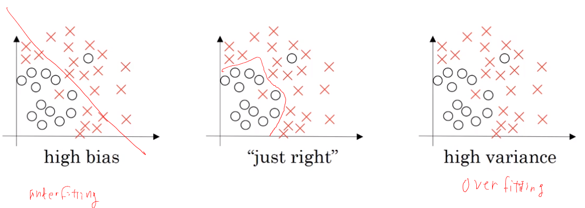
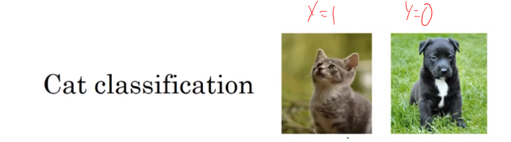
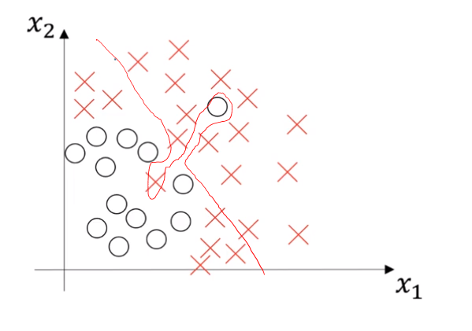

# Bias - Variance tradeoff

| data     | Over Fitting  | Under Fitting | Under Fitting            | Just Fit               |
| -------- | ------------- | ------------- | ------------------------ | ---------------------- |
| Training | 1%            | 15%           | 15%                      | 0.5%                   |
| Dev      | 11%           | 16%           | 30%                      | 1%                     |
|          | High Variance | High bias     | High bias, High Variance | Low bias, low Variance |

Based on assumption that human error is $\approx$ 0%

**$\color{red}{Optimal (Bayes) Error}$** $\approx$ 0 %

Training set would provide a sense of bias and Dev set would provide a sense of variance.

$\uparrow$ **High bias and high variance plot**
