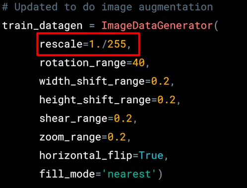

# Coding augmentation with ImageDataGenerator

**Rotation range** is a range from 0-180 degrees with which to randomly rotate images. The image will rotate by random amount between 0 and 40 degrees.

**Shifting**, moves the image around inside its frame. Many pictures have the subject centered. So if we train based on those kind of images, we might over-fit for that scenario. These parameters specify, as a proportion of the image size, how much we should randomly move the subject around. So in this case, we might offset it by 20 percent vertically or horizontally.

**Shear_range** creates a new image that is a shear_image copy of an existing one. Shearing slides one edge of an image along the X or Y axis, creating a parallelogram. An X direction shear slides an edge along the X axis, while a Y direction shear slides an edge along the Y axis. The amount of the shear is controlled by a shear angle.

More info [here](https://keras.io/preprocessing/image/)
