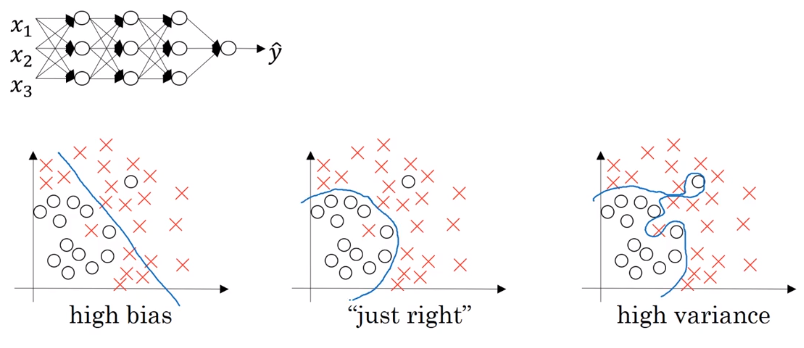
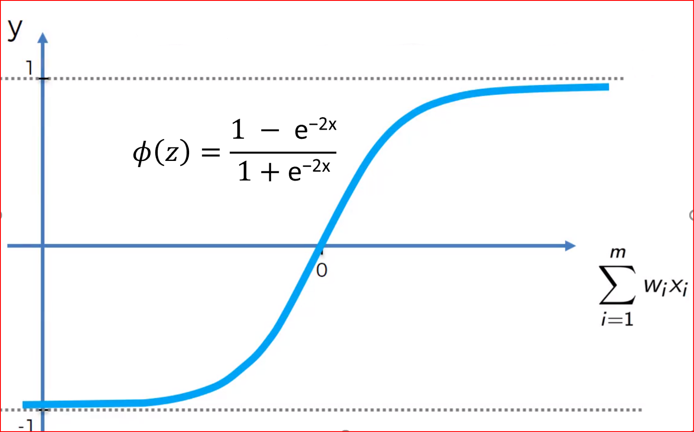

# Regularization

To reduce variance or prevent overfitting, regularization is one of the tool to be used.

## Logistic Regression

In logistic regression, we want to minimize the cost function.

$J(w,b)=\frac{1}{m}\sum_{i=1}^{m}L(\hat{y}^{(i)},y^{(i)}) \tag{1}$

where $w \in \mathbb{R}^{n_x}$ and $b\in \mathbb{R}$.

To add regularization to the logistic regression, you add $\frac{\lambda}{2m}$ times the norm of $w$ squared. $\lambda$ is called the regularization parameter.

$J(w,b)=\frac{1}{m}\sum_{i=1}^{m}L(\hat{y}^{(i)},y^{(i)})+\frac{\lambda}{2m}*||w||_2^2 \tag{2}$

**L2 Regularization:** $\frac{\lambda}{2m}||w||_2^2 =\frac{\lambda}{2m} \sum_{j=1}^{n_x}w_j^2=\frac{\lambda}{2m}w^Tw$. $\leftarrow$ is much more commong in deep neural network$

**L1 Regularization:** $\frac{\lambda}{2m}||w||_1=\frac{\lambda}{2m} \sum_{j=1}^{n_x}|w_j|$.

L1 regularization will make $w$ sparse. (More zeros)

* $\lambda$ is a regularization parameter (hyperparameter), set this using your development set or hold-out cross validation set

## Neural Network

In neural network, we have a cost function;

$J(w^{[1]}, b^{[1]}, \cdots, w^{[m]}, b^{[m]})=\frac{1}{m}\sum_{i=1}^mL(\hat{y}^{(i)},y^{(i)}) \tag{3}$

To add regularization to the neural network, you add $\frac{\lambda}{2m}$ times $\sum_{l=1}^L||w^{[l]}||^2$.

$J(w^{[1]}, b^{[1]}, \cdots, w^{[m]}, b^{[m]})=\frac{1}{m}\sum_{i=1}^mL(\hat{y}^{(i)},y^{(i)})+\sum_{l=1}^L||w^{[l]}||^2 \tag{4}$

where $||w^{[l]}||_F^2=\sum_{i=1}^{[l-1]} \sum_{j=1}^{[l]} (w_{uj}^{[l]})^2$ because w: $(n^{[l]}, n^{[l-1]})$ matrix. This is called $\color{red}{\text{Frobenius norm}}$

$dW=\frac{\partial J}{\partial W^{[l]}}+\frac{\lambda}{m}W^{[l]}$ from backpropagation and
parameter $W^{[l]}=W^{[l]}-\alpha dW^{[l]}$.

L2 regularization is also sometimes called $\color{red}{\text{weight decay}}$.

**Mathmatically,**

$\begin{align}
dW&=\frac{\partial J}{\partial W^{[l]}}+\frac{\lambda}{m}W^{[l]} \tag{5}\\
&=W^{[l]}-\alpha[(\text{from backprop})+\frac{\lambda}{m}W^{[l]}] \tag{6}\\
&=\underbrace{W^{[l]}-\frac{\alpha \lambda}{m}W^{[l]}}_{W^{l}*(1-\frac{\alpha\lambda}{m})}-\alpha (\text{from backprop})\tag{7}
\end{align}$

It is called 'weight decay' because the first tem is multipling $(1-\frac{\alpha\lambda}{m})$ which is less than $1$

## Why regularization reduces overfitting?

$J(W^{[l]}, b^{[l]})=\frac{1}{m}\sum_{i=1}^{m}L(\hat{y}^{(i)}, y^{(i)})+ \color{red}{\frac{\lambda}{m}\sum_{l=1}^L||W^{[l]}||_F^2}$

So why is it that shrinking the L two norm or the Frobenius norm or the parameters might cause less overfitting?  **It sets the weight to be so close to zero for a lot of hidden units that's basically zeroing out a lot of the impact of these hidden units. And if that's the case, then this much simplified neural network becomes a much smaller neural network.** In fact, it is almost like a logistic regression unit, but stacked most probably as deep. $\leftarrow W^{[l]}\approx 0$

Another reason

g(z): tanh(z)
When z is close to zero, then we are using the linear regime of the tanh function. If $\lambda$ is large, then $W^{[l]}$ is small, and $z^{[l]}$ is also small since $z^{[l]}=W^{[l]}a^{[l-1]}+b{[l]}$, and if z is closer to 0, then every layer is $\approx$ linear.
