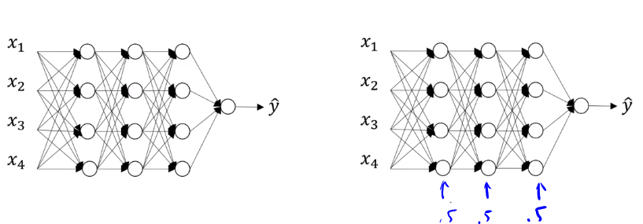
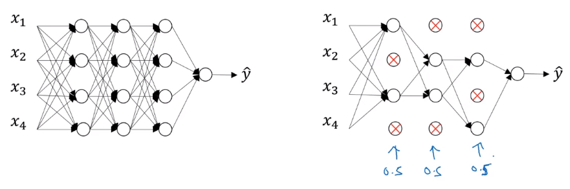

# Dropout regularization



:arrow_right: 0.5 probability to retain or **drop nodes** from each layer **for each training example**.



:arrow_right: Drop nodes at probability of 0.5 and **remove edges** to make a smaller neural network for each training example.

How to you implement dropout regularization?

## Inverted Dropout

Illustration with layer $l$=3

d3: dropout vector of layer 3
keep_prob: probability to keep the nodes

```Python
keep_prob=0.8
d3=np.random.rand(a3.shape[0], a3.shape[1])<keep_prob
a3=np.multiply(a3, d3) #element wise multiplication
a3 /= keep_prob # divide a3 with keep_prob
```

When a3 is (50,1) matrix, then 10 units will be shut off.
$z^{[4]}=W^{[4]}a^{[3]}+b^{[4]}$ and $a^{[3]}$ is reduced by 20%, so $a^{[3]}$ has to be divided up by 80%

## Do not dropout at test times

$a^{[0]}=X$

**No Dropout**

$z^{[1]}=W^{[1]}a^{[0]}+b^{[1]}$

$a^{[1]}=g^{[1]}(z^{[1]})$

$z^{[2]}=W^{[2]}a^{[1]}+b^{[2]}$

$a^{[2]}=g^{[2]}(z^{[2]})$

$\vdots$

$\hat{y}$

## Why does inverse dropout work?
**First Intuition:** if on every iteration you're working with a smaller neural network, and so using a smaller neural network seems like it should have a regularizing effect

**Second Intuition:** Can't rely on any one feature, so have to spread out weights. $\leftarrow$ Shrinks Weights
