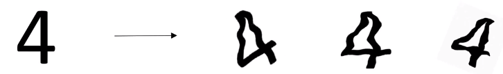
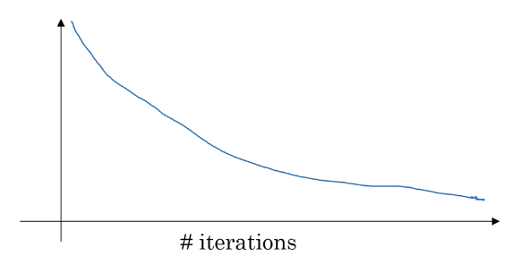
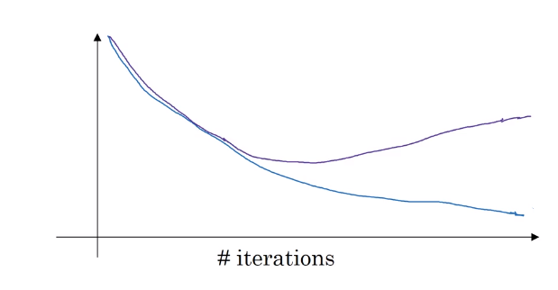

# Other regularization methods

Recall,

| Over Fitting              | Under Fitting             | Under Fitting            | Just Fit               |
| ------------------------- | ------------------------- | ------------------------ | ---------------------- |
| High **V**ariance         | High bias                 | High bias, High Variance | Low bias, low Variance |
| get more data             | bigger networks           |                          |                        |
| try regularization        | traing longer             |                          |                        |
| different NN architecture | different NN architecture |                          |                        |

## Data Augmentation

* Getting more training data can be expensive. Flipping the image horizontally and add that to the training set doble the size of the training set. This strategy is not as good as get more new training data.

* You could also rotate it randomly and zoon in/out.

* More examples of data augmentation

* Data augmentation is another method of regularization to reduce the variance.

## Early Stopping

* Plotting the **error** or **cost function J** is a debugging method to evaluate the algorithm.

* With early stopping, **dev set error** is also plotted. When dev set error stops decreasing, then you could stop the training half way.

* Why does early stopping work? $w \approx 0$ at the beginning of the training, but as you train more, $w$ gets larger and larger. Early stopping will stop the training half way or mid size of $||w||_{F}^2$, similar to L2 regularization

* There is one **downside** of early stopping. In ML, you want to
  - optimize the cost function with gradient descent, momentum, $\cdots$
  - Not overfit by regularization, add more data, $\cdots$

  so, you want to implement controls that only affect a single component of your algorithms performance at a time. This is called **Orthogonalization**, but with early stopping, you can no longer have control over each component independently.
