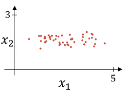
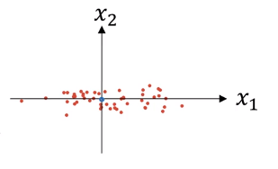
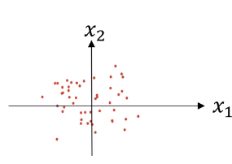
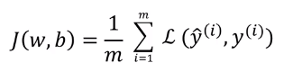
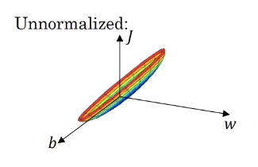
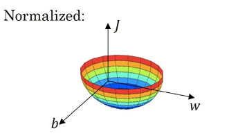

# Normalizing inputs

## Normaligin training sets

* Training set with two input features $X=\begin{bmatrix}x_1\\x_2\end{bmatrix}$

* Normalizing involves two steps:

  1. Subtract Mean $\mu=\frac{1}{m}\sum_{i=1}^mx^{i}$, $x:=x-\mu$
  
  Notice here that the feature $x_1$ has a much larger variance than the feature $x_2$ here
  2. Normalize variance
  $\sigma^2=\frac{1}{m}\sum_{i=1}^mx^{i}\underbrace{**}_{element-wise}2$, $x:/=\sigma^2$

  

  * Use same $\mu^2$ to normalize test set

## Why normalize inputs?

If unnormalized, cost function would look like below.

If normalized, cost function would look like more symetrical.

If you're running gradient descent on the cost function on unnormalized, then you might have to use a very small learning rate because the gradient descent might need a lot of steps to oscillate back and forth before it finally finds its way to the minimum. Whereas if you have a more spherical contours in normalized, then wherever you start gradient descent can pretty much go straight to the minimum.
