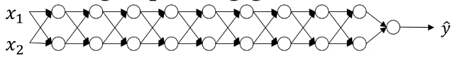

# Vanishing.Exploding Gradients

One of the problems of training neural network, especially very deep neural networks, is data vanishing and exploding gradients. What that means is that when we're training a very deep network our derivatives or our slopes can sometimes get either very, very big or very, very small, maybe even exponentially small, and this makes training difficult.

  $\begin{matrix}&&W^{[1]}&W^{[2]}&W^{[3]}\cdots&&&&&&&&&&&&&&&&W^{[L]}\end{matrix}$

Assume linear activation $g(z)=z$ and $b^{[l]}=0$. In this case,

$\hat{y}=W^{[L]}W^{[L-1]}W^{[L-2]}\cdots W^{[3]}W^{[2]}W^{[1]}x$ since

$z^{[1]}=W^{[1]}x=W^{[1]}a^{[0]}$

$a^{[1]}=g(z^{[1]})=z^{[1]}$

$z^{[2]}=W^{[2]}a^{[1]}$

$a^{[2]}=g(z^{[2]})=g(W^{[2]}a^{[1]})=g(W^{[2]}z^{[1]})=g(W^{[2]}W^{[1]}x)$

Let's assume,

$W^{[l]}=\begin{bmatrix}1.5&0\\0&1.5\end{bmatrix}$ then

$\hat{y}=W^{[L]}\begin{bmatrix}1.5&0\\0&1.5\end{bmatrix}^{L-1}x$ so,

$\hat{y}$ is essentially $1.5^{L-1}x$.

**If $L$ is large then $\hat{y}$ is also large.**

Conversely, when

$W^{[l]}=\begin{bmatrix}0.5&0\\0&0.5\end{bmatrix}$ then

$\hat{y}$ is essentially $0.5^{L-1}x$.

**If $L$ is large then $\hat{y}$ is very small.**

**If $W^{[l]}>$ `Identity Matrix`, then with a very deep network the activations can explode**

**If $W^{[l]}<$ `Identity Matrix`, then with a very deep network the activations will decrease exponentially**

To solve this problem, careful selection of parameter initialization is required.
