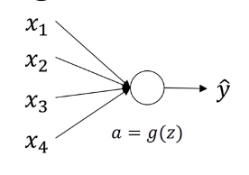

# Weight Initialization for Deep networks



$z=w_1x_1+w_2x_2+w_3x_3+w_4x_4$ assuming $b=0$

In order to avoid vanishing and explding gradient:
* Large $n$, you want smaller $w_i$

One reasonable thing to do would be to set the **variance of** $w_i=\frac{1}{n^{[l-1]}}$ , where $n$ is the number of input features that's going into a neuron.

```Python
wl=np.random.rand(shape)*np.sqrt(1/n^(l-1))
```

For **ReLU activation**,  **variance of** $w_i=\frac{2}{n^{[l-1]}}$ works better.

```Python
wl=np.random.rand(shape)*np.sqrt(2/n^(l-1))
```

For **tanh activation**,  **variance of** $w_i=\frac{1}{n^{[l-1]}}$ works better.
This is called Xavier initialization.
```Python
wl=np.random.rand(shape)*np.sqrt(1/n^(l-1))
```

Another version we're taught by Yoshua Bengio for **tanh activation**
 **variance of** $w_i=\frac{2}{n^{[l-1]}+n^{[l]}}$ .
```Python
wl=np.random.rand(shape)*np.sqrt(2/(n^(l-1)+n^l))
```

This doesn't solve valinishing/exploding gradients, but it helps.


This variance is one of the hyperparameter but the effect can be small.
