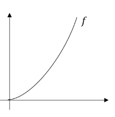
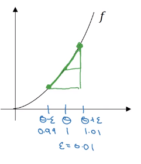

# Numerical approximation of gradient

When you implement back propagation you'll find that there's a test called creating checking that can really help you make sure that your implementation of back prop is correct.

$f(\theta)=\theta ^3$

Instead of  just nudging theta to the right to get theta plus epsilon ($\theta+\epsilon$), we're going to nudge it to the right and nudge it to the left to get theta minus epsilon ($\theta-\epsilon$). $(\theta+\epsilon)$ is 1.01 and $(\theta-\epsilon)$ is 0.99 when $\epsilon$=0.01.

 It turns out that rather than taking a small triangle from $\theta$ to $\theta+\epsilon$ and computing the height over the width, you can get a much better estimate of the gradient if you take a larger triangle from $\theta-\epsilon$ to $\theta+\epsilon$ and compute the height over width of this bigger triangle.

 

 The **height** of the triangle is $f(\theta+\epsilon)-f(\theta-\epsilon)$
 The **wideth** of the triangle is $2\theta$, so
 $\frac{f(\theta+\epsilon)-f(\theta-\epsilon)}{2\theta}\approx g(\theta)$

 $\frac{(1.01)^3 - (0,99)^3}{2(0.01)}=3.0001$

 Since $g(\theta)=3\theta^2=3$ so the above approximation is pretty close
