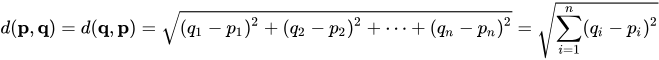

# Gradient Checking

## Gradient check for a neural network

1. Take $W^{[1]}, b^{[1]}, \cdots, W^{[L]}, b^{[L]}$ and reshape and concatenate them into a big vector $\theta$
  - $J(W^{[1]}, b^{[1]}, \cdots, W^{[L]}, b^{[L]})=J(\theta)$
2. Take $dW^{[1]}, db^{[1]}, \cdots, dW^{[L]}, db^{[L]}$ and reshape and concatenate them into a big vector $d\theta$
  - Quesiton is is $d\theta$ a gradient of $J(\theta)$

## Implementaiton of gradient checking
for each $i$:

$\begin{align}d\theta_{approx}^{[i]}&=\frac{J(\theta_1, \theta_2, \cdots, \theta_i+\epsilon)-J(\theta_1, \theta_2, \cdots, \theta_i-\epsilon)}{2\epsilon}\\
&\approx d\theta^{[i]}=\frac{\partial J}{\partial i}\end{align}$

Then compare $d\theta_{approx}$ against $d\theta$.

## Euclidean distance between $d\theta_{approx}$ and $d\theta$
The Euclidean distance between points p and q is the length of the line segment connecting them ( $\overline{\mathbf{p}\mathbf{q}}$).

In Cartesian coordinates, if $\mathbf{p} = (p1, p2,..., pn)$ and $\mathbf{q} = (q1, q2,..., qn)$ are two points in Euclidean n-space, then the distance (d) from p to q, or from q to p is given by the Pythagorean formula:

This is the sum of squares of elements of the differences, and then you take a square root, as you get the Euclidean distance.

Distance $\frac{||d\theta_{approx} - d\theta||_2}{||d\theta_{approx}||_2+||d\theta||}$

$\approx 10^{-7}$ $\leftarrow$ Good

$\approx 10^{-5}$ $\leftarrow$ Dobule check

$\approx 10^{-3}$ $\leftarrow$ Worry

$\epsilon=10^{-7}$ is a typical

## Gradient checking implementation Notes

1. **Don't use gradient checking in training, but only to debug,** because computing $d\theta_{approx}[i]$ for all the values of $i$ is very slow computation.
2.  **If algorithm fails gradient check, look at components (such as $db^{[l]} or $dw^{[l]}$) to try to identiy bug.**  If $d\theta_{approx}[i]$  is very far from $d\theta[i]$, look at the different values of $i$ to see which are the values of $d\theta_{approx}[i]$ that are really very different than the values of $d\theta[i]$.
3. **Remember regularization** - $J(\theta)=\frac{1}{m}\sum_{i=1}^{m}L(\hat{y}^{(i)}, y^{(i)})+ \color{red}{\frac{\lambda}{m}\sum_{l=1}^L||W^{[l]}||_F^2}$
and $d\theta$ is a gradient of J with respect to $\theta$ which includes **regularization** term.

4. **Doesn't work with dropout**, because in every iteration, dropout is randomly eliminating different subsets of the hidden units. There isn't an easy to compute cost function J that dropout is doing gradient descent on. It turns out that dropout can be viewed as optimizing some cost function J, but it's cost function J defined by summing over all exponentially large subsets of nodes they could eliminate in any iteration. So the cost function J is very difficult to compute, and you're just sampling the cost function every time you eliminate different random subsets in those we use dropout. So it's difficult to use grad check to double check your computation with dropouts. So it is recommended to implement grad check without dropout. You can set keep-prob and dropout to be equal to 1.0. and then turn on dropout and hope that the implementation of dropout was correct.

5. **Run at random initializationl perhaps again after some training.** **It rarely happens**, but it's not impossible that your implementation of gradient descent is correct when $w$ and $b$ are close to 0 at random initialization. But as you run gradient descent and $w$ and $b$ become bigger, maybe your implementation of backprop is correct only when $w$ and $b$ is close to 0, but it gets more inaccurate when $w$ and $b$ become large. One solution is to run grad check at random initialization and then train the network for a while so that $w$ and $b$ have some time to wander away from 0 from your small random initial values. And then run grad check again after you've trained for some number of iterations.
