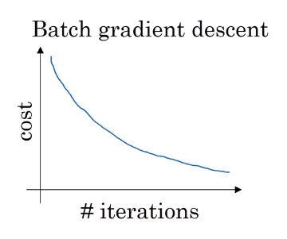
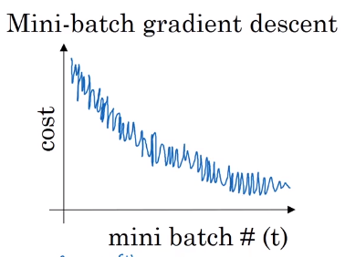
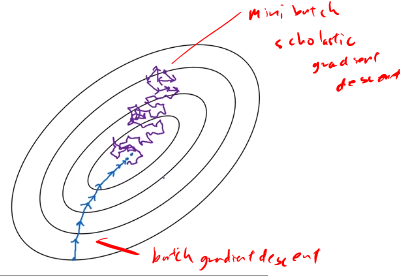

# Mini Batch Gradient

## Batch vs. mini-batch gradient descent

Vectorization allows efficient computation on $m$ examples.

$X=[x^{(1)}, x^{(2)}, \cdots, x^{(m)}]$

$(n_x, m)$

$Y=[y^{(1)}, y^{(2)}, \cdots, y^{(m)}]$

$(1,m)$

What if $m=5,000,000$? You can get a faster algorithm if you let gradient descent start to make some progress even before you finish processing your entire, your giant training sets of 5 million examples.

Mini Batch: Small training sets, m=1,000

$X^{\{1\}}=[x^{(1)}, x^{(2)}, \cdots, x^{(1000)}]$, $X^{\{2\}}=[x^{(1001)}, x^{(2)}, \cdots, x^{(2000)}]$ etc. You would get $X^{\{1\}}, X^{\{2\}} \cdots X^{\{5000\}}$

We can repeat this for $Y$

$Y^{\{1\}}=[y^{(1)}, y^{(2)}, \cdots, y^{(1000)}]$, $Y^{\{2\}}=[y^{(1001)}, y^{(2)}, \cdots, y^{(2000)}]$ etc. You would get $Y^{\{1\}}, Y^{\{2\}} \cdots Y^{\{5000\}}$

So, mini-batch $t$: $X^{\{t\}}, Y^{\{t\}}$

## Mini-batch gradient descent

for $t=1, \cdots ,1000$:

  forward prop on $X^{\{t\}}$ 
>    $Z^{[1]}=W^{[1]}X^{\{t\}}+b^{[1]}$ 
>    $A^{[1]}=g^{[1]}(Z^{[1]})$ 
>    $\vdots$ 
>    $A^{[L]}=g^{[L]}(Z^{[L]})$ 

then compute cost $J^{\{t\}}=\frac{1}{1000} \sum_{i=1}^{l}$ $L(\hat{y}^{(i)},y^{(i)})$ = $\frac{\lambda}{2*1000}\sum_{l=1}^{L}||W^{\{t\}}||_F^2$

- Backprogagation
- Update parameters

**Epoch** Single path through training set

# Understanding mini-batch gradient descent

With batch gradient descent on every iteration you go through the entire training set and you'd expect the cost to go down on every single iteration.

On mini batch gradient descent though, if you plot progress on your cost function, then it may not decrease on every iteration.  If you plot J{t}, as you're training mini batch in descent it may be over multiple epochs, you might expect to see a curve like this.

## Choosing mini-batch size
* If **mini-batch size $=m$**, then you end up with **batch gradient descent**.

$(X^{\{1\}},Y^{\{1\}})$

* If **mini-batch size $=1$**, then you end up with **stochastic gradient descent** and every examples are mini-batch

* In practice choose somewhere between 1 and m

---
* **Batch gradient descent**: mini-batch size $=m$, and takes too much time per iteration, since the size is big for each iteration.
* **In between 1 and $m$**: fastest learning.
  - lots of vectorization
  - make progress without needing to wait til you process the entire training set.
* **Stochastic graident descent**: Loose speed from Vectorization
___
1. If you have a small training set: Us Batch Gradient Descent (m<2000)
2. If you have big $m$, then mini-batch size is 64, 128, 256, 512
3. Make sure your mini-batch $(X^{\{t\}}, Y^{\{t\}})$ fit CPU and GPU memory
