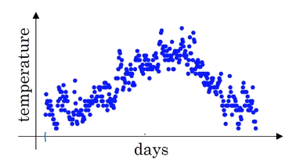
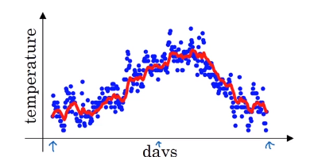
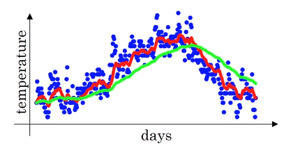
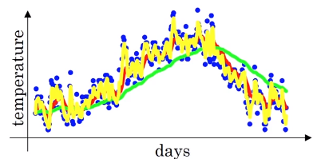
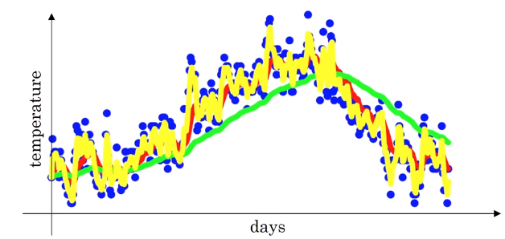
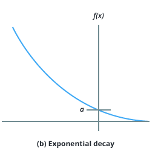

# Exponentially weighted averages

## Daily temperature in London
$\theta_1=40^\circ F$ 
$\theta_2=49^\circ F$ 
$\theta_3=45^\circ F$ 
$\vdots$ 
$\vdots$ 
$\theta_{180}=60^\circ F$ 
$\theta_{181}=56^\circ F$ 
$\vdots$ 

To compute the trends, the local average or a moving average of the temperature, here is the steps:

1.Initialize

$v_0=0$

$v_1=0.9\theta_0 + 0.1\theta_1$

$v_2=0.9\theta_1 + 0.1\theta_2$

$v_3=0.9\theta_2 + 0.1\theta_3$

$\vdots$

$v_t=0.9\theta_{t-1} + 0.1\theta_t$

$v_t$ gives $\color{red}{\text{red line}}$ which is **exponentially weighted average**

### Exponentially weighted averages
$v_t=\beta v_{t-1} + (1-\beta) v_t \tag{1}$

$v_t \approx$ average over $\frac{1}{1-\beta}$ day's temperature, so

* $\color{red}{\text{red line }} \beta=0.9 \approx$ 10 days's average temperature
* $\color{green}{\text{green line }} \beta=0.98 \approx$ 50 days's average temperature

Notice:

1. The higher $\beta$ gives more smoother curve because it is the average of more days
2. The higher $\beta$ gives slower adaptation of new temperature **(more latency)** since the weight to the current temperature is very small.

* $\color{yellow}{\text{yellow line }} \beta=0.5 \approx$ 2 days's average temperature

Notice:

1. More noisy
2. More susceptible to outliers
3. Quicker to adapt to a new temperature

# Understanding of exponentially weighted averages
**Exponentially weighted averages** will turn out to be a key component of several optimization algorithms that you used to train your neural networks.

$v_t=\beta v_{t-1} + (1-\beta)v_t$ gives following:
* $\color{red}{\text{red line}}$ when $\beta = 0.9$
* $\color{green}{\text{green line}}$ when $\beta = 0.98$
* $\color{yellow}{\text{yellow line}}$ when $\beta = 0.5$

Let's $\beta = 0.9$ and write few equations:

$v_{100}=0.9 v_{99} + 0.1v_{100}$

$v_{99}=0.9 v_{98} + 0.1v_{99}$

$v_{98}=0.9 v_{97} + 0.1v_{98}$

$\vdots$

So,

$v_{100}= 0.1v_{100}+ 0.9\underbrace{v_{99}}_{0.1v_{99}+0.9 \underbrace{v_{98}}_{0.1v_{98}+0.9 v_{97}}}$

$v_{100}=0.1\theta_{100}+0.1*0.9\theta_{99}+0.1*(0.9)^2\theta_{98}+0.1*(0.9)^3\theta_{97}+0.1*(0.9)^4\theta_{96}+ \cdots$

☝️ Exponentially decaying function

## Implementation of exponentially weighted averages

How do you implement below?

$v_0=0$

$v_1=\beta v_0 + (1-\beta)v_1$

$v_2=\beta v_1 + (1-\beta)v_2$

$v_3=\beta v_2 + (1-\beta)v_3$

$\vdots$

In practice:

$v_{\theta}:=0$

$v_{\theta}:=\beta v + (1-\beta)\theta_1$

$v_{\theta}:=\beta v + (1-\beta)\theta_2$

$\vdots$

---
$v_{\theta}=0$

Repeat {

get next $\theta_t$

$v_{\theta}:=\beta v_{\theta} + (1-\beta)\theta_t$

}
