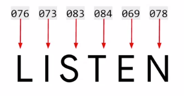
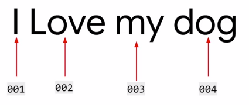
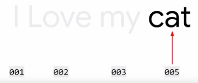
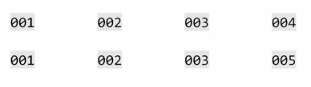

# Sentiment Analysis using TensorFlow

## Word based encoding

**Character based encoding**

ASCII encoding




Both have the same letter, the ASCII encoding ofcourse does not encode semantics of the words .


**Word based encoding**



You will find the similarity in the sentences


## In Practice

```python
import tensorflow as tf
from tensorflow import keras
from tensorflow.keras.preprocessing.text import Tokenizer

sentences = [
'i love my dog',
'I love my cat'

]

tokenizer = Tokenizer(num_words =100)
#1 The fit on texts method of the tokenizer then takes in the data and encodes it.
tokenizer.fit_on_texts(sentences)
#2 The tokenizer provides a word index property which returns a dictionary
#containing key value pairs, where the key is the word, and the value is the
# token for that word
word_index=tokenizer.word_index

print(word_index)
```
Output
```
{'i': 1, 'love': 2, 'my': 3, 'dog': 4, 'cat': 5}
```

```
sentences = [
'i love my dog',
'I love my cat',
'you love my dog!'
]

tokenizer = Tokenizer(num_words =100)
tokenizer.fit_on_texts(sentences)
word_index=tokenizer.word_index

print(word_index)

```

```
{'love': 1, 'my': 2, 'i': 3, 'dog': 4, 'cat': 5, 'you': 6}
```


## Using tensorflow for tokenization
### How to tokenize the words and sentences, building up a dictionary of all the words to make a corpus with tensorflow?
```Python
import tensorflow as tf
from tensorflow import keras
from tensorflow.keras.preprocessing.text import Tokenizer

sentences = [
    'i love my dog',
    'I, love my cat',
    'You love my dog!'
]

tokenizer = Tokenizer(num_words = 100)
tokenizer.fit_on_texts(sentences)
word_index = tokenizer.word_index
print(word_index)
```
{'love': 1, 'my': 2, 'i': 3, 'dog': 4, 'cat': 5, 'you': 6}

Notice that

* Punctuations are removed.
* i and I get the same coding
* ordered based on the count

The next step will be to turn your sentences into lists of values based on these tokens.

`texts_to_sequences` can encode sentences. It can take any set of sentences, so it can encode them based on the word set that it learned from the one that was passed into fit on texts.

```Python
sentences = [
    'i love my dog',
    'I, love my cat',
    'You love my dog!',
    'Do you think my dog is amazing?'
]

tokenizer =Tokenizer(num_words=100)
tokenizer.fit_on_texts(sentences)
word_idx=tokenizer.word_index

sequences=tokenizer.texts_to_sequences(sentences)

print(word_idx)
print(sequences)
```
{'my': 1, 'love': 2, 'dog': 3, 'i': 4, 'you': 5, 'cat': 6, 'do': 7, 'think': 8, 'is': 9, 'amazing': 10}
[[4, 2, 1, 3], [4, 2, 1, 6], [5, 2, 1, 3], [7, 5, 8, 1, 3, 9, 10]]
```Python
test_data=[
    'i realy love my dog',
    'my dog loves my manatee'
    ]

test_seq = tokenizer.texts_to_sequences(test_data)
print(test_seq)
```
[[4, 2, 1, 3], [1, 3, 1]]

Because 'loves' and 'manatee' are not trained, my dog my 1,3,1 are the encoding of the second sentence.

## Out of vocab
First of all, we really need a lot of training data to get a broad vocabulary or we could end up with sentences like, my dog my. Secondly, in many cases, it's a good idea to instead of just ignoring unseen words, to put a special value in when an unseen word is encountered. It can be done by add a property oov token to the tokenizer constructor
```Python
sentences = [
    'i love my dog',
    'I, love my cat',
    'You love my dog!',
    'Do you think my dog is amazing?'
]

tokenizer =Tokenizer(num_words=100, oov_token='<oov>') #out of vocab
tokenizer.fit_on_texts(sentences)
word_idx=tokenizer.word_index

sequences=tokenizer.texts_to_sequences(sentences)

print(word_idx)
print(sequences)

test_data=[
    'i realy love my dog',
    'my dog loves my manatee'
    ]

test_seq = tokenizer.texts_to_sequences(test_data)
print(test_seq)
```
{'<oov>': 1, 'my': 2, 'love': 3, 'dog': 4, 'i': 5, 'you': 6, 'cat': 7, 'do': 8, 'think': 9, 'is': 10, 'amazing': 11}
[[5, 3, 2, 4], [5, 3, 2, 7], [6, 3, 2, 4], [8, 6, 9, 2, 4, 10, 11]]
[[5, 1, 3, 2, 4], [2, 4, 1, 2, 1]]

## Padding
use `pad_sequences` from kears.preprocessing.sequence

`pad_sequences(sequences, padding='post', maxlen=5`

padds '0' from the front unless `padding='post'`` is used.

```Python
from tensorflow.keras.preprocessing.sequence import pad_sequences

print(sequences)
padded = pad_sequences(sequences)
print(padded)
```

[[5, 3, 2, 4], [5, 3, 2, 7], [6, 3, 2, 4], [8, 6, 9, 2, 4, 10, 11]]<br>
[[ 0  0  0  5  3  2  4]<br>
 [ 0  0  0  5  3  2  7]<br>
 [ 0  0  0  6  3  2  4]<br>
 [ 8  6  9  2  4 10 11]]

`maxlen` sets the limit of the sequence

```Python
padded = pad_sequences(sequences, padding='post', maxlen=5)
print(padded)
```
[[ 5  3  2  4  0]<br>
 [ 5  3  2  7  0]<br>
 [ 6  3  2  4  0]<br>
 [ 9  2  4 10 11]]<br>

Note that the longest sentence was truncated from the front. By passing truncating='post', will truncate from the back

```python
padded = pad_sequences(sequences,
                       padding='post',
                        maxlen=6,
                        truncating='post')
print(padded)
```
[[ 5  3  2  4  0  0]<br>
 [ 5  3  2  7  0  0]<br>
 [ 6  3  2  4  0  0]<br>
 [ 8  6  9  2  4 10]]<br>

```python
test_seq = tokenizer.texts_to_sequences(test_data)
print(test_seq)

padded = pad_sequences(test_seq,
                       padding='post',
                        maxlen=10,
                        truncating='post')
```
[[5, 1, 3, 2, 4], [2, 4, 1, 2, 1]]
```python
print(padded)
```
[[5 1 3 2 4 0 0 0 0 0]<br>
 [2 4 1 2 1 0 0 0 0 0]]<br>
 ```python
print(word_idx)
```
{'<oov>': 1, 'my': 2, 'love': 3, 'dog': 4, 'i': 5, 'you': 6, 'cat': 7, 'do': 8, 'think': 9, 'is': 10, 'amazing': 11}

## Train on larger text data
Sample text data https://storage.googleapis.com/laurencemoroney-blog.appspot.com/sarcasm.json

```python
!wget --no-check-certificate \
    https://storage.googleapis.com/laurencemoroney-blog.appspot.com/sarcasm.json \
    -O /tmp/sarcasm.json
```
--2019-08-05 20:37:18--  https://storage.googleapis.com/laurencemoroney-blog.appspot.com/sarcasm.json
Resolving storage.googleapis.com (storage.googleapis.com)... 172.217.13.240, 2607:f8b0:4004:810::2010
Connecting to storage.googleapis.com (storage.googleapis.com)|172.217.13.240|:443... connected.<br>
HTTP request sent, awaiting response... 200 OK
Length: 5643545 (5.4M) [application/json]
Saving to: ‘/tmp/sarcasm.json’

/tmp/sarcasm.json   100%[===================>]   5.38M  --.-KB/s    in 0.06s

2019-08-05 20:37:18 (86.5 MB/s) - ‘/tmp/sarcasm.json’ saved [5643545/5643545]

Sample of JSON file
`[
{"article_link": "https://www.huffingtonpost.com/entry/versace-black-code_us_5861fbefe4b0de3a08f600d5", "headline": "former versace store clerk sues over secret 'black code' for minority shoppers", "is_sarcastic": 0},
{"article_link": "https://www.huffingtonpost.com/entry/roseanne-revival-review_us_5ab3a497e4b054d118e04365", "headline": "the 'roseanne' revival catches up to our thorny political mood, for better and worse", "is_sarcastic": 0},
{"article_link": "https://local.theonion.com/mom-starting-to-fear-son-s-web-series-closest-thing-she-1819576697", "headline": "mom starting to fear son's web series closest thing she will have to grandchild", "is_sarcastic": 1},
{"article_link": "https://politics.theonion.com/boehner-just-wants-wife-to-listen-not-come-up-with-alt-1819574302", "headline": "boehner just wants wife to listen, not come up with alternative debt-reduction ideas", "is_sarcastic": 1},
{"article_link": "https://www.huffingtonpost.com/entry/jk-rowling-wishes-snape-happy-birthday_us_569117c4e4b0cad15e64fdcb", "headline": "j.k. rowling wishes snape happy birthday in the most magical way", "is_sarcastic": 0},
{"article_link": "https://www.huffingtonpost.com/entry/advancing-the-worlds-women_b_6810038.html", "headline": "advancing the world's women", "is_sarcastic": 0},
{"article_link": "https://www.huffingtonpost.com/entry/how-meat-is-grown-in-a-lab_us_561d1189e4b0c5a1ce607e86", "headline": "the fascinating case for eating lab-grown meat", "is_sarcastic": 0},
{"article_link": "https://www.huffingtonpost.com/entry/boxed-college-tuition-ben_n_7445644.html", "headline": "this ceo will send your kids to school, if you work for his company", "is_sarcastic": 0},
{"article_link": "https://politics.theonion.com/top-snake-handler-leaves-sinking-huckabee-campaign-1819578231", "headline": "top snake handler leaves sinking huckabee campaign", "is_sarcastic": 1},
{"article_link": "https://www.huffingtonpost.com/entry/fridays-morning-email-inside-trumps-presser-for-the-ages_us_58a6e33ee4b07602ad53a315", "headline": "friday's morning email: inside trump's presser for the ages", "is_sarcastic": 0},
{"article_link": "https://www.huffingtonpost.com/entry/airline-passengers-tackle-man-who-rushes-cockpit-in-bomb-threat_us_59302e57e4b07572bdbf9460", "headline": "airline passengers tackle man who rushes cockpit in bomb threat", "is_sarcastic": 0},
{"article_link": "https://www.huffingtonpost.com/entry/facebook-healthcare_n_5926140.html", "headline": "facebook reportedly working on healthcare features and apps", "is_sarcastic": 0},
{"article_link": "https://www.huffingtonpost.comhttp://www.theguardian.com/world/2016/may/31/north-korea-praises-trump-and-urges-us-voters-to-reject-dull-hillary", "headline": "north korea praises trump and urges us voters to reject 'dull hillary'", "is_sarcastic": 0},`

  ```python
import json

with open("/tmp/sarcasm.json", 'r') as f:
    datastore = json.load(f)


sentences = []
labels = []
urls = []
for item in datastore:
    sentences.append(item['headline'])
    labels.append(item['is_sarcastic'])
    urls.append(item['article_link'])
from tensorflow.keras.preprocessing.text import Tokenizer
from tensorflow.keras.preprocessing.sequence import pad_sequences

tokenizer = Tokenizer(oov_token="<OOV>")
tokenizer.fit_on_texts(sentences)

word_index = tokenizer.word_index
print(len(word_index))
print(word_index)
sequences = tokenizer.texts_to_sequences(sentences)
padded = pad_sequences(sequences, padding='post')
print(padded[0])
print(padded.shape)
```
