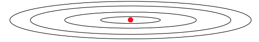
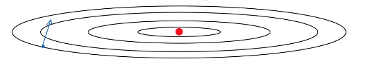
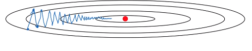
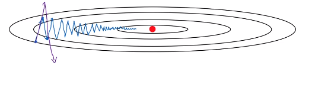
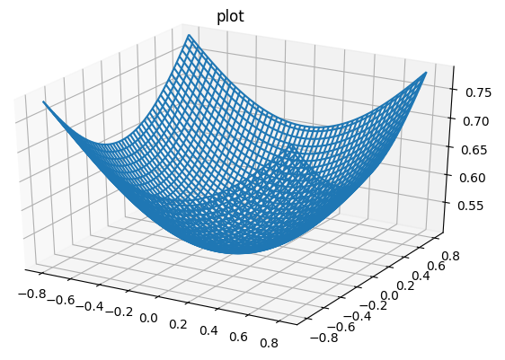

a# Gradient descent with momentum

Gradient descent with momentum almost always works faster than the standard gradient descent algorithm.
The basic idea is to compute an exponentially weighted average of your gradients, and then use that gradient to update your weights instead.

1. Red position represents the minimum.

2. With one iteration of batch or mini-batch gradient descent

3. Second iteration of gradient descent

4. Gradient descent will slowly oscillate toward the minimum.  This up and down oscillations slows down gradient descent and prevents you from using a much larger learning rate.

5. With a much larger learning rate you might end up over shooting and end up diverging. So to prevent the oscillations from getting too big forces you to use a learning rate that's not too large.
 

 * For $\updownarrow$, you want slow learning
 * For $\longleftrightarrow$, you want faster learning, because you want to aggressively move from left to right toward the minimum.

## Implementation of gradient descent with momentum

On iteration $t:$ 
> Compute $dW, db$ on current mini-batch
>
> $v_{dW}=\beta v_{dW} + (1-\beta)dW$
>
> $v_{db}=\beta v_{db} + (1-\beta)db$$

Then update parameters:

> $W=W-\alpha v_{dW}$
>
> $b=b-\alpha v_{db}$

Imagein you have a bowl, $dW$ and $db$ are acceleration, and $v_{dW}$ and $v_{db}$ are velocity, and since $\beta$ is less than one, it act as a friction to limit the gradient decent to speed up.

> $v_{dW}=\beta v_{dW} + (1-\beta)dW$
>
> $v_{db}=\beta v_{db} + (1-\beta)db$$

### Implementation details

On iteration $t:$ 
> Compute $dW, db$ on current mini-batch
>
> $v_{dW}=\beta v_{dW} + (1-\beta)dW$
>
> $v_{db}=\beta v_{db} + (1-\beta)db$$

Then update parameters:

> $W=W-\alpha v_{dW}$
>
> $b=b-\alpha v_{db}$

Hyperparameters: $\alpha$, $\beta$

In general $\beta=0.9$ is a robust number

Bias correction: People usually do not do this because after just ten iterations, your moving average will have warmed up and is no longer a bias estimate:  $\frac{v_{dW}}{1-\beta^t}$

**Note**
In some literature $1-\beta$ is ommited so,
> $\color{purple}{v_{dW}=\beta v_{dW} + dW}$
>
> $\color{purple}{v_{db}=\beta v_{db} + db}$$

The net effect of using this version in purple is that $v_{dW}$ ends up being scaled by a factor of  $1-\beta$.

One impact of this is that if you end up tuning the hyperparameter $\beta$, then this affects the scaling of $v_{dW}$ and $v_{db}$ as well. And so you end up needing to retune the learning rate, $\alpha$, as well,
