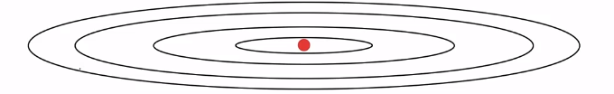
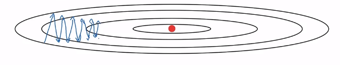
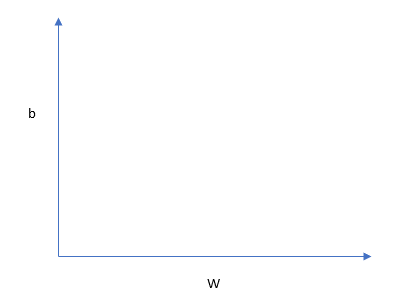
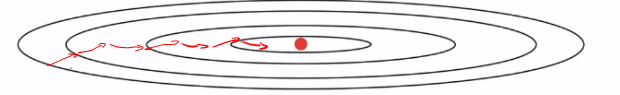

# Optimization Algorithms: RMSprop

There's another algorithm called RMSprop, which stands for root mean square prop, that can also speed up gradient descent.

1. Red position represents the minimum.

2. If you implement gradient descent, you can end up with huge oscillations in the vertical direction, even while it's trying to make progress in the horizontal direction

Assume we have $b$ vertically and $W$ horizontally, we want $b$ to learn slowly and $w$ to lean quicker.

On iteration $t:$ 
> Compute $dW, db$ on current mini-batch
>
> $s_{dW}=\beta s_{dW} + (1-\beta)dW^{\overbrace{2}^{\text{element wise}}}$ $\leftarrow$ small
>
> $s_{db}=\beta s_{db} + (1-\beta)db^{\overbrace{2}^{\text{element wise}}}$ $\leftarrow$ large

Then update parameters:

> $W=W-\alpha \frac{dW}{\sqrt{dW}+\epsilon}$
>
> $b=b-\alpha \frac{db}{\sqrt{db}+\epsilon}$

IN practice you add a small $\epsilon$ something like $10^{-8}$

Because the function is sloped much more steeply in the vertical direction $w$ than as in the $b$ direction so, $db^2$ will be relatively large. So $s_{db}$ will relatively large, whereas compared to that $s_{dW}$ will be smaller. So the net effect of this is that your updates in the vertical direction are divided by a much larger number, and so that helps damp out the oscillations. Whereas the updates in the horizontal direction are divided by a smaller number. So the net impact of using RMSprop is that your updates will end up looking more like the red line in below figure.

