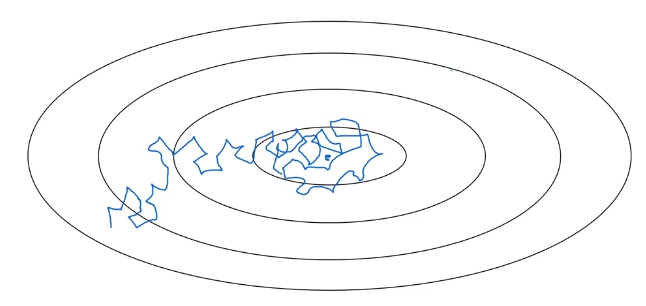
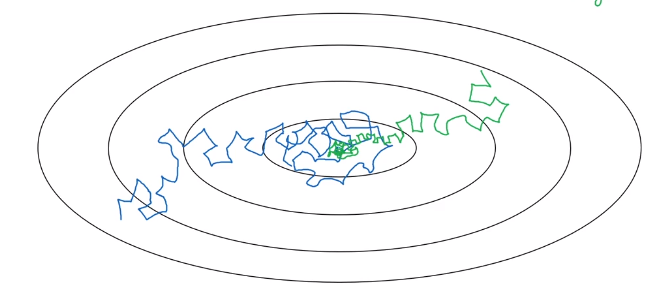
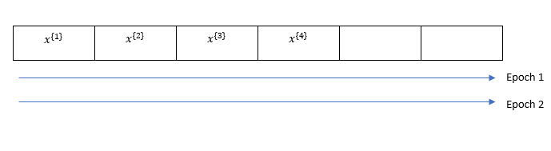
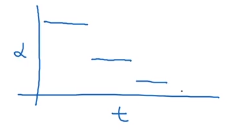

# Learning rate decay

One of the things that might help speed up your learning algorithm, is to slowly reduce your learning rate over time. This is called learning rate decay.

 Suppose you're implementing mini-batch gradient descent, with a reasonably small mini-batch. Maybe a mini-batch has just 64, 128 examples. Then as you iterate, your steps will be a little bit noisy. And it will tend towards this minimum over the center, but it won't exactly converge. But your algorithm might just end up wandering around, and never really converge, because you're using some fixed value for alpha.

 

 But if you were to slowly reduce your learning rate alpha, then during the initial phases, while your learning rate alpha is still large, you can still have relatively fast learning. But then as alpha gets smaller, your steps you take will be slower and smaller. And so you end up oscillating in a tighter region around this minimum, rather than wandering far away, even as training goes on and on.

 

 ## Implementation of learning rate decay

 1 epoch = 1 pass through the data

 

 $\alpha = \frac{1}{1+\text{(decay rate)}*\text{(epoch num)}}\alpha_0 \tag{1}$

**Example of learning rate decay:**

$\alpha_0=0.2$ and $\text{(decay rate)}=1$

Then

| epoch | $\alpha$ |
| ----- | -------- |
| 1     | 0.1      |
| 2     | 0.67     |
| 3     | 0.5      |
| 4     | 0.4      |
| $\vdots$      |$\vdots$          |

so slowly decaying the learning rate

 ## Other Implementation of learning rate decay

  $\alpha = 0.95^{\text{(epoch num)}}\alpha_0 \tag{2}$

  (2) is exponential decay

  $\alpha=\frac{k}{\sqrt{\text{(epoch num)}}}\alpha_0 \tag{3}$

  $\alpha=\frac{k}{\sqrt{\text{(mini-batch num (t))}}}\alpha_0 \tag{3}$

  or some uses discrete staircase

  

  or manual decay
