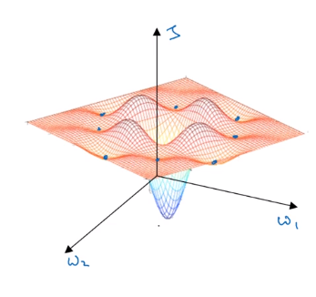
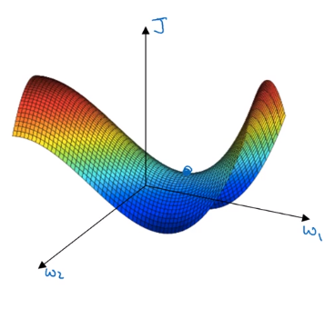
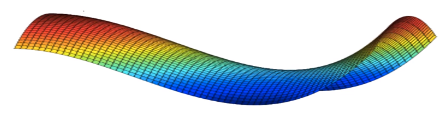

# Local optima

It looks like there are a lot of local optima as shown as blue dots. And it'd be easy for grading the sense, or one of the other algorithms to get stuck in a local optimum rather than find its way to a global optimum which is represented as the bottom of the blue network.

In many cases, the zero derivative is not the global optima but local optima but in high dimentional spaces, you will likely get the saddle point than local optima.

## Problem of plateau
 If local optima aren't a problem, then what is a problem?  It turns out that plateaus can really slow down learning and a plateau is a region where the derivative is close to zero for a long time. Plateau is a region where the derivative is close to zero for a long time.

 

 ## Note:
 - If you have high dimentional spaces (many parameters) then it is unlikely to get stuck in a bad local optima.
 - Plateaus can make learning slow
