#Tuning Process

## Hyperparameters

A deep learning algorithm requires tuning of following possible set of Hyperparameters

---
**First important:**
- Learning rate $\alpha$
---
**Second important**
- Momentum term $\beta$= 0.9
- number of hidden units
- mini-batch size
---
**Third important**
- number of layers
- learning rate decay
---
**Forth important**
- Adam $\beta_1, \beta_2, \epsilon$: 0.9, 0.09, $10^{-8}$

## How do you select a set of values to explore?

* Don't use _grid search_ in deep learning

Impose a grid on possible space of a hyperparameter and then go over each cell of grid one by one and evaluate your model against values from that cell. Grid method tends to vast resources in trying out parameter values which would not make sense at all.
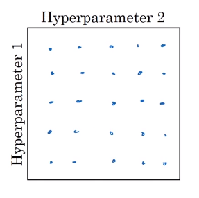

* Try _random values_ in deep learning

In random method, we have high probability of finding good set of params quickly. After doing random sampling for a while, we can zoom into the area indicative of good set of params - coarse to fine search

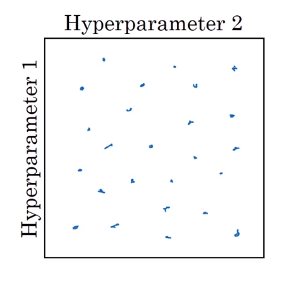

* We could start with a larger coarse samples, then later forcus on a smaller dense samples
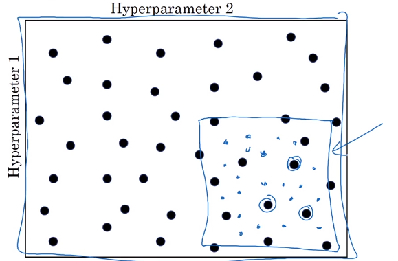

## Using an appropriate scale to pick hyperparameters
Sampling at random doesn't mean sampling uniformly at random, over the range of valid values. Instead, it's important to pick the appropriate scale on which to explore the hyperparamaters.

### Sampling uniformly at random over the range
Let's go to an example where **sampling uniformly at random over the range** of

$n^{[l]}=50, \cdots, 100$

It is reasonable to pick random numbers from this line between 50 and 100.
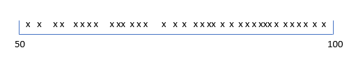

Another example could be choosing a number of layers from L: 2-4

In this case, the grid search is still reasonable. [2, 3, 4]

### Appropriate scale for hyperparameters

Sometimes, uniformly random sample values are not appropriate. For example, choosing random numbers from learning rate: $\alpha=0.0001, \cdots, 1$

If we use uniformly random sample values from 0.0001 to 0.1 then most of the values are between 0.1 and 1, so this is not correct.
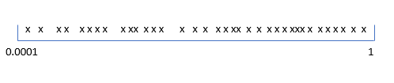

We could sample random numbers on log-scale.
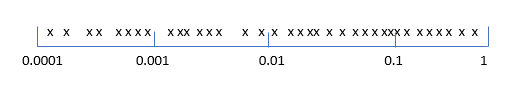

In Python,

```Python
r=-4*np.random.rand()
learning_rate=10**r
```
`r`$\in [-4,0]$ and `learning_rate`=$10^{-4}, \cdots, 10^0$

### Hyperparameters for exponentially weighted averages

Another example where uniformly random sample values are not appropriate is a choosing $\beta$ for expomemtially weighted averages.

$\beta=0.9, \cdots, 0.999$ $\leftarrow$ This is the range of values we want to use.

It's not appropriate to take the random numbers from uniformly distributed random numbers.
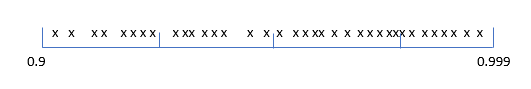

Since $1-\beta = 0.1, \cdots, 0.001$ we can take random numbers from log scales

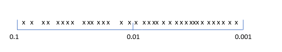

$r \in [-3, -1]$

$1-\beta=10^r$

$\beta=1-10^r$

* When $\beta$ is close to 1, $\frac{1}{1- \beta}$, is very sensitive to small changes in $\beta$

## Hyperparameters tuning in practice

Deep learning is being used in many different areas - NLP, vision, logistics, ads, etc. We may not transfer hyperparameter tuning from one area to another. Therefore, we should perhaps not get locked with our intuition and rather consider to reevaluate the intuition.

### Babysitting Model
Babsitting works well when we do not have enough computational power or capacity to train a lot of models at once. We patiently measure our models performance over time and tune hyperparameter based its performance of pervious day.

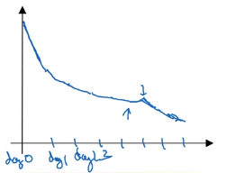

This is like Panda strategy - pandasat babysitting one baby panda at a time so that it does well eventually.

### Training Many Models in Parallel
We train many models in parallel, each against different hyperparameter settings. Potentially, these models will generate different learning curves. At end we will pick the model with best learning curve. This approach is known as Caviar strategy.

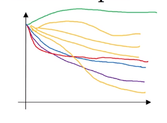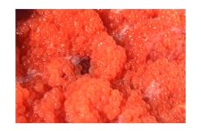
