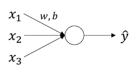
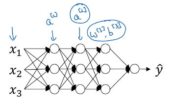

# Normalizing activations in a network

One of the most important ideas has been an algorithm called [**batch normalization**](https://stomioka.github.io/deeplearning/docs/047-normalizing-activations-in-network.html), created by two researchers, Sergey Ioffe and Christian Szegedy. **Batch normalization** makes your hyperparameter search problem much easier, makes your neural network much more robust. The choice of hyperparameters is a much bigger range of hyperparameters that work well, and will also enable us to much more easily train even very deep networks.

## Normalizing inputs to speed up learning
In **logistic regression**, normalizing the input speed up learning.

$\mu=\frac{1}{m}\sum_{i=1}^mx^{(i)}$

$x=x-\mu$

$\sigma ^2=\frac{1}{m}\sum_{i=1}^mx^{(i)\overbrace{2}^{\text{element wise}}}$

then normalize with variance

$x=\frac{x}{\sigma^2}$

In **deep learning**, we normalize $a^{[2]}$ so train $w^{[3]}, b^{[3]}$ faster with **batch normalization**. Technically, it is achived by normalizing $z^{[2]}$

## How do we implement batch norm?

GIven some intermediate values in the neural network, $z^{[l](i)}, \cdots, z^{[L](m)}$

$\mu=\frac{1}{m}\sum_{i=1}^mz^{[l](i)}$

$\sigma ^2=\frac{1}{m}\sum_{i=1}^m(z_i-\mu)^2$

then normalizing $z^{(i)}$

$z^{(i)}_{norm}=\frac{z^{(i)}-\mu}{\sqrt{\sigma^2+\epsilon}}$

here we add $\epsilon$ to add stability in case $\sigma^2$ turns out to be 0.

So every component of $z$ has mean 0 and variance 1. But we don't want the hidden units to always have mean 0 and variance 1. Maybe it makes sense for hidden units to have a different distribution,

$\tilde{z}^{(i)}=\gamma z^{(i)}_{norm}+\beta$

Here $\gamma, \beta$ are learnable parameters of the model. Notice that the effect of $\gamma$ and $\beta$ is that it allows to set the mean of $\tilde{z}$ to be whatever values. In fact, if $\gamma={\sqrt{\sigma^2+\epsilon}}$ is the denominator of $z^{(i)}_{norm}$ and $\beta=\mu$ then the effect of $\gamma z^{(i)}_{norm}+\beta$ is that it would exactly invert the equation $z^{(i)}_{norm}$. If that is true, then $\tilde{z}^{(i)}= z^{(i)}$.

In the neural network, instead of using $z^{[l](i)}, \cdots, z^{[L](m)}$, now we can use $\tilde{z}^{[l](i)}, \cdots, \tilde{z}^{[L](m)}$.
