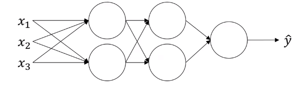
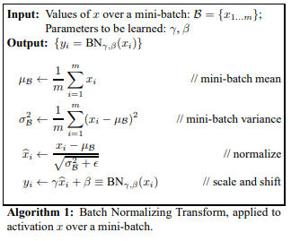

# Fitting batch norm into a neural network

For deep neural network, here is how [**batch normalization**](https://stomioka.github.io/deeplearning/docs/047-normalizing-activations-in-network.html) is implemented.

$x \xrightarrow[]{W^{[1]},b^{[1]} )}z^{[1]}\xrightarrow[\text{batch norm (BN)}]{\beta^{[1]}, \gamma^{[1]}}\tilde{z}^{[1]}\xrightarrow[]{}a^{[1]}=g^{[1]}(\tilde{z}^{[1]})\xrightarrow[]{W^{[2]},b^{[2]} )}z^{[2]}\xrightarrow[\text{batch norm (BN)}]{\beta^{[2]}, \gamma^{[2]}}\tilde{z}^{[2]}\xrightarrow[]{}a^{[2]}=g^{[2]}(\tilde{z}^{[2]})$

and parameters are:

$W^{[1]}, b^{[1]}, W^{[2]}, b^{[2]}, \cdots, W^{[L]}, b^{[L]},$ 
$\beta^{[1]}, \gamma^{[1]}, \beta^{[2]}, \gamma^{[2]},\cdots, \beta^{[L]}, \gamma^{[L]},$

then compute $d\beta^{[l]}$ and update parameters $\beta^{[l]}=\beta^{[l]}-\alpha d\beta^{[l]}$

Note that these $\beta^{[L]}$ is nothing to do with $\beta$ for momentum

This can be easily implementated with NN framework. For example with tensorflow, you can use `tf.nn.batch_normalization`

Ioffe, Sergey and Christian Szegedy. “Batch Normalization: Accelerating Deep Network Training by Reducing Internal Covariate Shift.” ICML (2015).

## Working with mini-batches

Similarly, [**batch normalization**](https://stomioka.github.io/deeplearning/docs/047-normalizing-activations-in-network.html) can be applied to [**mini-batch**](https://stomioka.github.io/deeplearning/docs/038-mini-batch-gradient.html) as follows:

$X \xrightarrow[]{W^{[1]},b^{[1]} )}z^{[1]}\xrightarrow[\text{batch norm (BN)}]{\beta^{[1]}, \gamma^{[1]}}\tilde{z}^{[1]}\xrightarrow[]{}a^{[1]}=g^{[1]}(\tilde{z}^{[1]})\xrightarrow[]{W^{[2]},b^{[2]} )}z^{[2]}\xrightarrow[\text{batch norm (BN)}]{\beta^{[2]}, \gamma^{[2]}}\tilde{z}^{[2]}\xrightarrow[]{}a^{[2]}=g^{[2]}(\tilde{z}^{[2]})$

and parameters are
$W^{[1]}, b^{[1]}, W^{[2]}, b^{[2]}, \cdots, W^{[L]}, b^{[L]},$ 
$\beta^{[1]}, \gamma^{[1]}, \beta^{[2]}, \gamma^{[2]},\cdots, \beta^{[L]}, \gamma^{[L]},$

Notice that $z^{[l]}$ is computed as $z^{[l]}=W^{[l]}a^{[l-1]}+b^{[l]}$, and  [**batch norm**](https://stomioka.github.io/deeplearning/docs/047-normalizing-activations-in-network.html) will look at the [**mini-batch**](https://stomioka.github.io/deeplearning/docs/038-mini-batch-gradient.html) and normalize $z^{[l]}$ to first of mean 0 and standard variance, and then a rescale by $\beta$ and $\gamma$. It means that whatever is the value of $b^{[l]}$ is actually going to just get subtracted out, because during that  [**batch norm**](https://stomioka.github.io/deeplearning/docs/047-normalizing-activations-in-network.html) step, you are going to compute the means of the $z^{[l]}$  and subtract the mean. So adding any constant to all of the examples in the [**mini-batch**](https://stomioka.github.io/deeplearning/docs/038-mini-batch-gradient.html) won't change anything. Therefore, the parameters are

$W^{[1]}, W^{[2]}, \cdots, W^{[L]}$ 
$\beta^{[1]}, \gamma^{[1]}, \beta^{[2]}, \gamma^{[2]},\cdots, \beta^{[L]}, \gamma^{[L]},$

and you will compute

$z^{[l]}=W^{[l]}a^{[l-1]}$

$z_{norm}^{[l]}$

$\tilde{z}^{[l]}=\gamma^{[l]}z_{norm}^{[l]}+\beta^{[l]}$

Since the shape of $z^{[l]}$ and  $b^{[l]}$ is ($n^{[l]},1$) so the shape of  $\beta^{[l]}$ and $\gamma^{[l]}$ is also  ($n^{[l]},1$).

## Implementing gradient descent with batch norm

Assuming we are using [mini-batch gradient descent](https://stomioka.github.io/deeplearning/docs/038-mini-batch-gradient.html):

for $t=1, \cdots,$ number of mini-batch
- compute forward prop on $X^{[t]}$
  - In each hidden layer, use BN to replace $z^{[l]}$ with $\tilde{z}^{[l]}$
- Use backprop to compute $dW^{[l]}, d\beta^{[l]}, d\gamma^{[l]}$
- Update Parameters
  - $W^{[l]}=W^{[l]}-\alpha dW^{[l]}$
  - $\beta^{[l]}=\beta^{[l]}-\alpha d\beta^{[l]}$
  - $\gamma^{[l]}=\gamma^{[l]}-\alpha d\gamma^{[l]}$

This also works with [gradient descent with momentum](https://stomioka.github.io/deeplearning/docs/041-gradient-descent-with-momentum.html), or [RMSprop](https://stomioka.github.io/deeplearning/docs/042-rmsprop.html), or [Adam](https://stomioka.github.io/deeplearning/docs/043-adam.html). Where instead of taking this gradient descent update, mini-batch you could use the updates given by these other algorithms.
