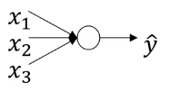
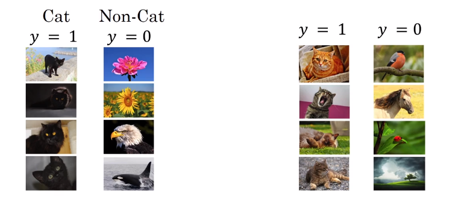
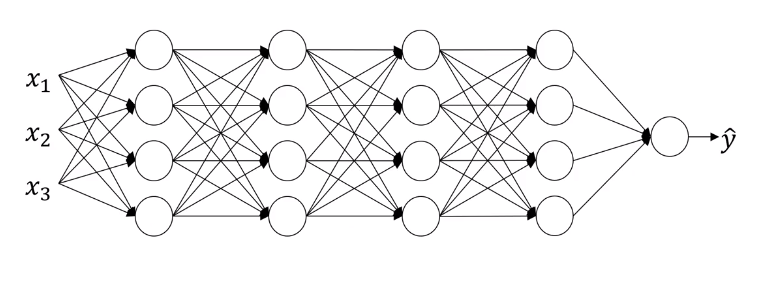
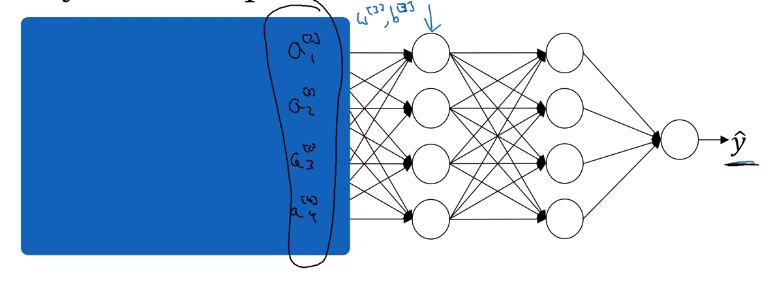
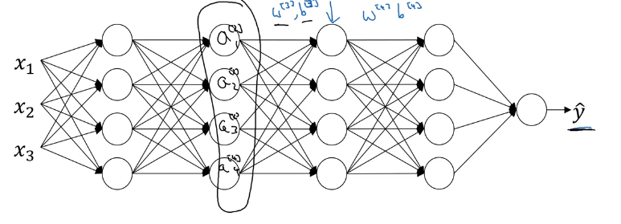

# Why batch norm work?

So, why does batch norm work?

## First reason
We know that how normalizing the input features, the X's, to mean zero and variance, how that can speed up learning. So rather than having some features that range from zero to one, and some from one to a 1,000, by normalizing all the features, input features X, to take on a similar range of values that can speed up learning. So, one intuition behind why batch norm works is that this is doing a similar thing, but further values in your hidden units and not just for your input layer.

## Second readon

Learning on shifting input distribution

 Let's say that you've trained your data sets on all images of black cats. If you now try to apply this network to data with colored cats where the positive examples are not just black cats like on the left, but to color cats like on the right, then your model might not do very well.

Even though there might be the same function that actually works well, but you wouldn't expect your learning algorithm to discover the decision boundary, just looking at the data on the left. So, this idea of data distribution changing is called, **covariate shift**.

The idea is that, if you've learned some X to Y mapping, if the distribution of X changes, then you might need to retrain your learning algorithm. And this is true even if the function, the ground true function, mapping from X to Y, remains unchanged.

And the need to retain your function becomes even more acute if the ground true function shifts as well.

How does this problem of **covariate shift** apply to a neural network?

Consider following deep neural network and let's look at the learning process from the third hidden layer.

So from the perspective of this third hidden layer, it gets some values, $a_1^{[2]}, a_2^{[2]}, a_3^{[2]}, a_4^{[2]}$ and the job of the third hidden layer is to take these values and find a way to map them to $\hat{y}$. So you can imagine doing great intercepts, so that these parameters $W_3$, $b_3$, $W_4$, $b_4$, and even $W_5$, $b_5$, maybe try and learn those parameters, so the network does a good job, mapping from the values on the left in the blue box to the output values $\hat{y}$.

If we uncover the blue box, the network is adapting $W_2$, $b_2$, $W_1$, $b_1$ and as these chagnes, the values $a_1^{[2]}, a_2^{[2]}, a_3^{[2]}, a_4^{[2]}$ also changes. From the perspective of the third layer, $a_1^{[2]}, a_2^{[2]}, a_3^{[2]}, a_4^{[2]}$ are always changing. What does [**batch norm**](https://stomioka.github.io/deeplearning/docs/047-normalizing-activations-in-network.html) is doing is that it reduces the amount that the distribution of these hidden unit values $a_1^{[2]}, a_2^{[2]}, a_3^{[2]}, a_4^{[2]}$ shift around. $\tilde{z}^{[l]}$ will have stable mean and $\sigma^2$ governed by $\beta^{[l]} and \gamma^{[l]}$.

## Batch Norm as Regularization
* Each mini-batch is scaled by the mean/bariance computed on just that mini-batch.
* This adds some noise to the values $z^{[l]}$ within that mini-batch. So simialrt to dropout, it adds some noise to each hidden layer's activations.
* This has a slight regularization effect because by adding noise to the hidden units, it's forcing the downstream hidden units not to rely too much on any one hidden unit. And so similar to dropout, it adds noise to the hidden layers and therefore has a very slight regularization effect.
* By using a large mini-batch (like 512) you are reducing noise and reducing the regularization effect.

Batch norm handles data one mini-batch at a time. It computes mean and variances on mini-batches. So at test time, you try and make predictors, try and evaluate the neural network, you might not have a mini-batch of examples, you might be processing one single example at the time. So, at test time you need to do something slightly differently to make sure your predictions make sense.
