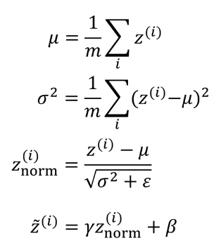
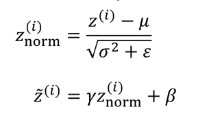

# Batch Norm at test time

$\mu$ and $\sigma^2$ are computed on  entire mini batch, but during the test time, you won't have the same size of mini-batch. You need some different way of coming up with mu and sigma squared.  In order to apply your neural network and test time is to come up with some separate estimate of $\mu$ and $\sigma^2$.

During the test time, $\mu$ and $\sigma^2$ are estimated using exponentially weighted average across the mini-batches.

Let's pick a layer $l$ and

$X^{\{1\}}, X^{\{2\}}, X^{\{3\}}, \cdots$

$\downarrow$  &nbsp;&nbsp;&nbsp;&nbsp;&nbsp;&nbsp;&nbsp;&nbsp;&nbsp;&nbsp;&nbsp;$\downarrow$&nbsp;&nbsp;&nbsp;&nbsp;&nbsp;&nbsp;&nbsp;&nbsp;&nbsp;$\downarrow$

$\mu^{\{1\}[l]} \mu^{\{2\}[l]} \mu^{\{3\}[l]}$

$\theta_1$&nbsp;&nbsp;&nbsp;&nbsp;&nbsp;&nbsp;&nbsp; $\theta_2$&nbsp;&nbsp;&nbsp;&nbsp;&nbsp;&nbsp;&nbsp; $\theta_3$

$\sigma^{2\{1\}[l]}$ $\sigma^{2\{2\}[l]}$ $\sigma^{3\{1\}[l]}$

Just as we saw how to use a exponentially weighted average to compute the mean of $\theta_1 \theta_21 \theta_3$ when you were trying to compute a exponentially weighted average of the current temperature, you would do that to keep track of what's the latest average value of this mean vector you've seen. So that exponentially weighted average becomes your estimate for what the mean of the Zs is for that hidden layer and similarly, you use an exponentially weighted average to keep track of these values of $\sigma^2$ that you see on the first mini batch in that layer, sigma square that you see on second mini batch and so on.

During test time, you use

But in practice, what people usually do is implement and exponentially weighted average where you just keep track of the $\mu$ and $\sigma^2$  values you're seeing during training and use and exponentially the weighted average, also sometimes called the **running average**, to just get a rough estimate of $\mu$ and $\sigma^2$ and then you use those values of $\mu$ and $\sigma^2$ that test time to do the scale and you need the head and unit values $z$.
