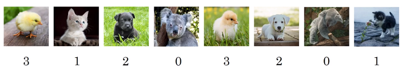
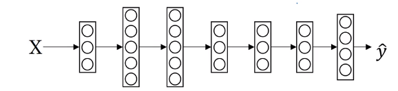
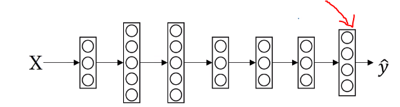
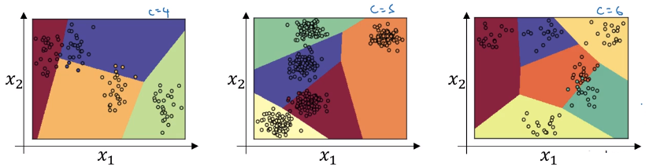

# Softmax Regression

There's a generalization of logistic regression called Softmax regression. The less you make predictions where you're trying to recognize one of C or one of multiple classes, rather than just recognize two classes.

Here is an example. Let's say  that we want to recognize cats, dogs, baby chicks, and other.

When we build a neural network, we have 4 output units. So, $n^{[L]}=4=C$

Output unit is computing $P('other'|x), P('cat'|x), P('dog'|x), P('chick'|x),$ and $\hat{y}$ is (4,1) shape. The standard model for getting your network to do this uses what's called a Softmax layer, and the output layer in order to generate these outputs.

The final layer of the neural network is computing the following:

**$z^{[L]}=W^{[L]}a{[L-1]}+b^{[L]}$**

## Activation function

* Temporaly variable: $t=e^{(z^{[L]})}$, (4,1)

* Then the output a{[L]}, is going to be basically the vector $t$ but normalized to sum to 1.
* $a^{[L]}=\frac{e^{(z^{[L]})}}{\sum_{j=1}^{4}t_i}$, (4,1) and
*  $a^{[L]}_i=\frac{t_i}{\sum_{j=1}^{4}t_i}$

## Example

Let $z^{[l]}=\begin{bmatrix}
5\\
2\\
-1\\
3
\end{bmatrix}$

Use element-wise exponentiation to compute $t$

$t=\begin{bmatrix}
e^5\\
e^2\\
e^{-1}\\
e^3
\end{bmatrix}=\begin{bmatrix}
148.4\\
7.4\\
0.4\\
20.1
\end{bmatrix}$ then sum up t

$\sum^4_{j=1}t_j=148.4+7.4+0.4+20.1=176.3$

and $a^{[L]}=\frac{t}{176.3}$

Therefore, the first unit of the output layer will output $\frac{e^5}{176.3}=0.842$

We can compute for all 4 output units as follow:

$\frac{e^5}{176.3}=0.842$

$\frac{e^2}{176.3}=0.042$

$\frac{e^-1}{176.3}=0.002$

$\frac{e^3}{176.3}=0.114$

then $a^{[l]}=g^{[l]}(z^{[L]})=\hat{y}$ will contain above 4 numbers.

Unlike other activation function such as sigmoid function which takes $\mathbb{R}$ and returns $\mathbb{R}$, sigmoid function will return a vector.

## Examples of Softmax
C=3

Note that the decision boundary are linear.

C=4, 5, 6

