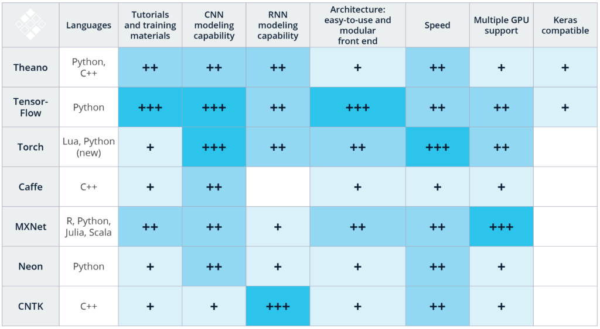

# Deep learning frameworks

https://www.kdnuggets.com/2017/03/getting-started-deep-learning.html

## Caffe2
Caffe2 is a deep-learning framework designed to easily express all model types, for example, CNN, RNN, and more, in a friendly python-based API, and execute them using a highly efficiently C++ and CUDA back-end. Users have flexibility to assemble their model using combinations of high-level and expressive operations in python allowing for easy visualization, or serializing the created model and directly using the underlying C++ implementation. Caffe2 supports single and multi-GPU execution, along with support for multi-node execution.

## MXNet
MXNet is a deep learning framework designed for both efficiency and flexibility. It allows you to mix the flavors of symbolic programming and imperative programming to maximize efficiency and productivity.

In its core is a dynamic dependency scheduler that automatically parallelizes both symbolic and imperative operations on the fly. A graph optimization layer on top of that makes symbolic execution fast and memory efficient. The library is portable and lightweight, and it scales to multiple GPUs and multiple machines.

## PyTorch
PyTorch is a Python package that provides two high-level features:

Tensor computation (like numpy) with strong GPU acceleration
Deep Neural Networks built on a tape-based autograd system

## TensorFlow
TensorFlow is an open source software library for numerical computation using data flow graphs. Nodes in the graph represent mathematical operations, while the graph edges represent the multidimensional data arrays (tensors) that flow between them. This flexible architecture lets you deploy computation to one or more CPUs or GPUs in a desktop, server, or mobile device without rewriting code. For visualizing TensorFlow results, TensorFlow offers TensorBoard, suite of visualization tools.

## PaddlePaddle
PaddlePaddle provides an intuitive and flexible interface for loading data and specifying model structures. It supports CNN, RNN, multiple variants and configures complicated deep models easily.

It also provides extremely optimized operations, memory recycling, and network communication. PaddlePaddle makes it easy to scale heterogeneous computing resources and storage to accelerate the training process.

## Chainer
Chainer is a Python-based deep learning framework aiming at flexibility. It provides automatic differentiation APIs based on the define-by-run approach, also known as dynamic computational graphs, as well as object-oriented high-level APIs to build and train neural networks. It supports CUDA and cuDNN using CuPy for high performance training and inference.

Some criteria for choosing deeop learning frameworks
* ease of Programming
* running speed
* truly open
