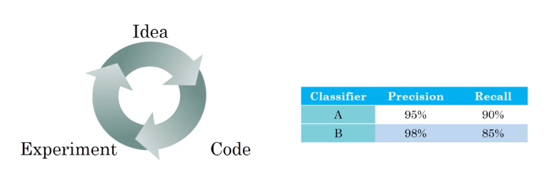
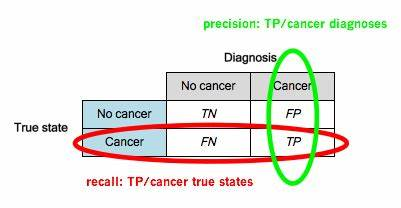
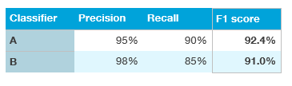
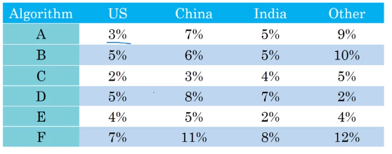
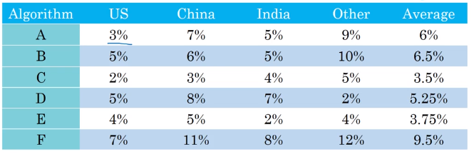

# Single number evaluation metric

**Classification accuracy** is an example of a ​single-number evaluation metric​: You run your classifier on the dev set (or test set), and get back a single number about what fraction of examples it classified correctly. According to this metric, if classifier A obtains 97% accuracy, and classifier B obtains 90% accuracy, then we judge classifier A to be superior.
In contrast, **Precision and Recall** is not a single-number evaluation metric: It gives two 3 numbers for assessing your classifier.

Having multiple-number evaluation metrics makes it harder to compare algorithms.

## Examle 1

Precision is $\frac{TP}{TP+FP}$
Recall is $\frac{TP}{TP+FN}$

Here, neither classifier is obviously superior, so it doesn’t immediately guide you toward picking one.

If we really care about both Precision and Recall, we could compute the “F1 score,” which is a **harmonic mean** of Precision and Recall.

$F_1$score=$\frac{2}{\frac{1}{P}+\frac{1}{R}}$

Having a single-number evaluation metric speeds up your ability to make a decision when you are selecting among a large number of classifiers. It gives a clear preference ranking among all of them, and therefore a clear direction for progress.

## Examle 2

As a final example, suppose you are separately tracking the accuracy of your cat classifier in four key markets: (i) US, (ii) China, (iii) India, and (iv) Other.

This gives four metrics. By taking an average or **weighted average** of these four numbers, you end up with a single number metric.

**Compute average**

Taking an average or weighted average is one of the most common ways to combine multiple metrics into one.
