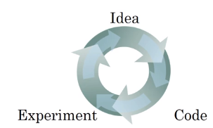

# Train/dev/test distributions

Let's say that you're building a cat classifier, and you are operating in these regions:
* U.S
* U.K
* other European countries
* South America
* India
* China
* other Asian countries
* Australia.

So, how do you set up your dev set and your test set?

## Example 1
One way you could do is to pick four of these regions randomly. And say, that data from these four regions will go into the dev set. And, the other four regions will go into the test set.
| data | country                  |
| ---- | ------------------------ |
| dev  | U.S                      |
|      | U.K                      |
|      | other European countries |
|      | South America            |
| test | India                    |
|      | China                    |
|      | other Asian countries    |
|      |Australia|
It turns out, this is a **very bad idea** because in this example, your dev and test sets come from different distributions. We need to find a way to make your dev and test sets come from the same distribution.

Setting up your dev set and single evaluation metric, that's like placing a target.

With established dev set and the metric, the team can innovate very quickly, try different ideas, run experiments and very quickly use the dev set and the metric to evaluate crossfires and try to pick the best one.

  So, machine learning teams are often very good at shooting different arrows into targets and innovating to get closer and closer to hitting the bullseye.

  Recommendation is to take randomly shuffled data using all data into the dev and test set. So that, both the dev and test sets have data from all eight regions and that the dev and test sets really come from the same distribution.

## Example 2
   Here's another example from a true story. A machine learning team that actually spent several months optimizing on a dev set which was comprised of loan approvals for medium income zip codes. The specific machine learning problem was, **"Given an input X about a loan application, can you predict why and which is, whether or not, they'll repay the loan?"** This helps you decide whether or not to approve a loan.

   The dev set came from loan applications. They came from medium income zip codes. After working on this for a few months, the team then, suddenly decided to test this on data from low income zip codes or low income postal codes. Of course, the distributional data for medium income and low income zip codes is very different. And, the classifier, that they spend so much time optimizing in the former case, just didn't work well at all on the latter case. This particular team actually wasted about three months of time and had to go back and really re-do a lot of work.

   **Guideline:** Cchoose a dev set and test set to reflect data you expect to get in future and consider important to do well on.

   
