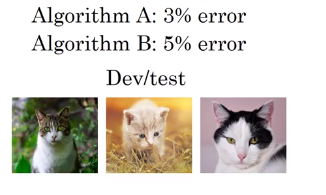
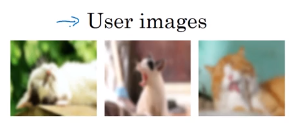

# When to change dev/test sets and metrics

When starting out on a new project, I try to quickly choose dev/test sets, since this gives the team a well-defined target to aim for.

## The metric is measuring something other than what the project needs to optimize.

**Cat dataset examples:**
Suppose that for your cat application, your metric is classification accuracy. This metric currently ranks classifier A as superior to classifier B. But suppose you try out both algorithms, and find classifier A is allowing occasional pornographic images to slip through. Even though classifier A is more accurate, the bad impression left by the occasional pornographic image means its performance is unacceptable. What do you do?
Here, the metric is failing to identify the fact that Algorithm B is in fact better than Algorithm A for your product. So, you can no longer trust the metric to pick the best algorithm. It is time to change evaluation metrics

**Metric: classification error**

**Classifier A:** 3% error but also gives some pornographic images

**Classifier B:** 5% error

Metric and dev prefers A, but users prefer B. In this case, you want to add a **weight**.

Error: $\frac{1}{m_{dev}}\sum_{i=1}^{m_{dev}}\color{red}{w^{(i)}}\mathcal{L}(y_{pred}^{(i)}, y^{(i)})$

where
$y_{pred}^{(i)}$ is a predicted value (0 or 1) and

$\color{red}{w^{(i)}}=\begin{cases}
1, & \text{if }x^{(i)}\text{ is not pornographic} \\
10, & \text{if }x^{(i)}\text{ is pornographic}
\end{cases}$ so this gives larger cost for pornographic images.

and $\frac{1}{m_{dev}}$ should be changed to $\color{red}{\frac{1}{\sum_{i=1}^{m_{dev}} w^{(i)}}}$ so we get the cost between 0 and 1.

So, $\mathcal{J}=\color{red}{\frac{1}{\sum_{i=1}^{m_{dev}} w^{(i)}}}\sum_{i=1}^{m_dev}\color{red}{w^{(i)}}\mathcal{L}(y_{pred}^{(i)}, y^{(i)})$

## Orthogonalization for cat pictures: anti-pornographic

1. So far we have only discussed how to define a metric to evaluate classifeirs.
2. Worry separately about how to do well on this metric.

## The actual distribution you need to do well on is different from the dev/test sets.

Suppose your initial dev/test set had mainly pictures of adult cats. You ship your cat app, and find that users are uploading low resolution images than expected.

Users care about the images they upload.

So, the dev/test set distribution is not representative of the actual distribution you need to do well on. In this case, update your dev/test sets to be more representative.

**So, if doing well on your metric + dev/test set doest not correspond to doing well on your application. Need to change your metric and/or dev/test set.**
