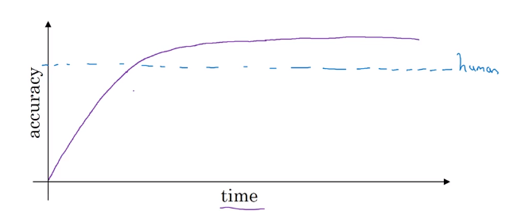
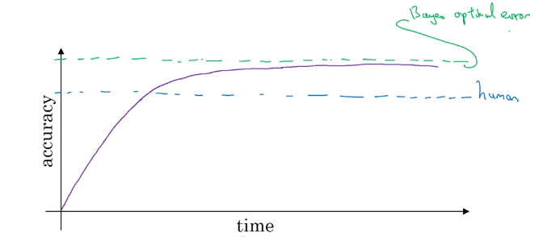

# Why human-level performance?

In the last few years, a lot more machine learning teams have been talking about comparing the machine learning systems to human level performance. Why is this?

 1.  because of advances in deep learning, machine learning algorithms are suddenly working much better and so it has become much more feasible in a lot of application areas for machine learning algorithms to actually become competitive with human-level performance.
 2.  it turns out that the workflow of designing and building a machine learning system, the workflow is much more efficient when you're trying to do something that humans can also do.

 So in those settings, it becomes natural to talk about comparing, or trying to mimic human-level performance.

## Comparing to human-level performance

A lot of machine learning tasks on a problem over time **(x-axis)**, many months or even many years over which some team or some research community is working on a problem. Progress tends to be relatively rapid as you approach human level performance. But then after a while, the algorithm surpasses human-level performance and then progress and accuracy actually slows down. And maybe it keeps getting better but after surpassing human level performance it can still get better, but performance, the slope of how rapid the accuracy's going up, often that slows down. And the hope is it achieves some theoretical optimum level of performance.

And over time, as you keep training the algorithm, maybe bigger and bigger models on more and more data, the performance approaches but never surpasses some theoretical limit, which is called the **Bayes optimal error**. So Bayes optimal erroris the best possible error.

## Why compare to human-level performance?

Humans are quite good at a lot of tasks. So long as ML is worse than humans, you can.
* Get labeled data from humans.
* Gain insight from manual error analysis: Why did a person get this right?
* Better analysis of bias/variance.
