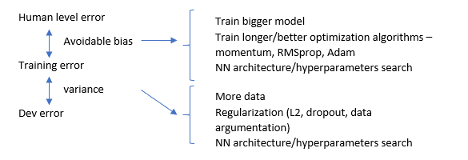

# Improving your model performance

## The two fudamental assumptions of supervised Learning

1. You can fit the training set pretty well.
2. The training set performance generalized pretty well to the dev/test set

## Reducing avoidable bias and variance

Look at the differences between **human level error**, **training error**, and **dev error**.

