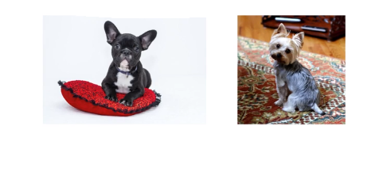
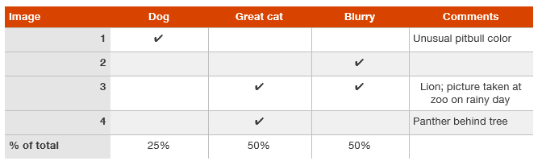

# Error Analysis

The process of looking at misclassified examples is called **​error analysis​**. It is the process of examining dev set examples that your algorithm misclassified, so that you can understand the underlying causes of the errors.

## Look at dev examples to evaluate ideas

Cat Clssifier:

| metric|value  |
| --- | --- |
|accuracy     | 90%    |
|error   |10%   |

Misclassification caused by these images

You can imagine building a focus effort, maybe to **collect more dog pictures**, or maybe to **design features specific to dogs**, or something. In order to make your cat classifier do better on dogs, so it stops misrecognizing these dogs as cats. **So the question is, should you go ahead and start a project focus on the dog problem?**

Later you may find out that the effort is worthless...

### Guideline:
1. Gather a sample of 100 dev set examples that your system ​misclassified
2. Look at these examples manually, and count how many are dog images.

The process of looking at misclassified examples is called **​error analysis​.** In this example, if you find that only **5% of the misclassified images are dogs**, then no matter how much you improve your algorithm’s performance on dog images, you **won’t get rid of more than 5% of your errors**.  In other word, 5% is a **“ceiling"**. At the best, you will get **9.5% error**, which is **5% less error than the original 10% error**.

If you find that **50% of the mistakes are dogs**, then you can be more confident that the proposed project will have a big impact. It could boost accuracy from 90% to 95% **(a 50% relative reduction in error, from 10% down to 5%)**.

## Evaluating multiple ideas in parallel during error analysis

Ideas for improving the cat detector:
- Fix the problem of your algorithm recognizing ​dogs as cats.
- Fix the problem of your algorithm recognizing ​great cats​ (lions, panthers, etc.) as house cats (pets).
- Improve the system’s performance on ​blurry​ images.

You can efficiently evaluate all of these ideas in parallel using a spreadsheet.

Although you may first formulate the categories (Dog, Great cat, Blurry) then categorize the examples by hand, in practice, once you start looking through examples, you will probably be inspired to propose new error categories.

**The goal of this process is to build your intuition about the most promising areas to focus on.**
