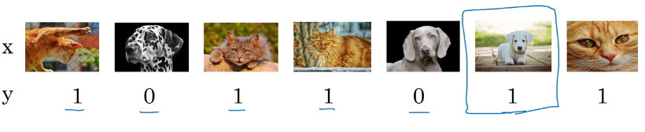
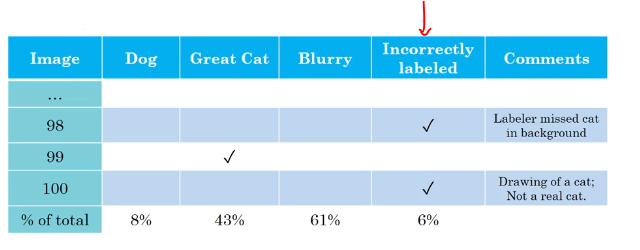

# Cleaning up incorrectly labeled data

During error analysis, you might notice that some examples in your dev set are mislabeled. For instance, the class label in an example ​(x,y) has an incorrect value for ​y.

Here is an example of incorrectly labeled data.

If you suspect the fraction of mislabeled images is significant, add a category to keep track of the fraction of examples mislabeled:
Image.

**Should you correct the labels in your dev set?**
Note that deep learning algotihms are quite robust to random errors in the training set. If the errors are reasonably random and the dataset is large, then it's probably okay to just leave the errors as they are.

 Remember that the goal of the dev set is to help you quickly evaluate algorithms so that you can tell if Algorithm A or B is better. **If the fraction of the dev set that is mislabeled impedes your ability to make these judgments, then it is worth spending time to fix the mislabeled dev set labels.**

For example, suppose your classifier’s performance is:
- Overall accuracy on dev set.………………. 90% (10% overall error.)
- Errors due to mislabeled examples………. 0.6% (6% of dev set errors.)
- Errors due to other causes………………… 9.4% (94% of dev set errors)

Here, the **0.6% inaccuracy due to mislabeling might not be significant enough relative to the 9.4%** of errors you could be improving. There is no harm in manually fixing the mislabeled images in the dev set, but **it is not crucial to do so**: It might be fine not knowing whether your system has 10% or 9.4% overall error.

Suppose you keep improving the cat classifier and reach the following performance:
- Overall accuracy on dev set.………………. 98% (2.0% overall error.)
- Errors due to mislabeled examples………. 0.6% (30% of dev set errors.)
- Errors due to other causes………………… 1.4% (70 % of dev set errors)

Guideline for correcting dev/test set Examples
* Apply same process to your dev and test sets to make sure they contune to come from the same distributionsconsider examoning examples your algorithm got right as well as ones it got wrong.
* Train and dev/test data may now come from slightly different distributions.
