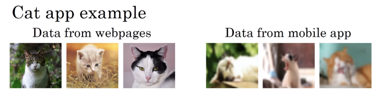
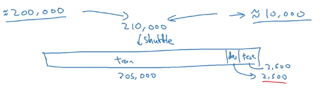
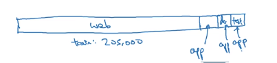
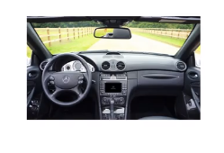
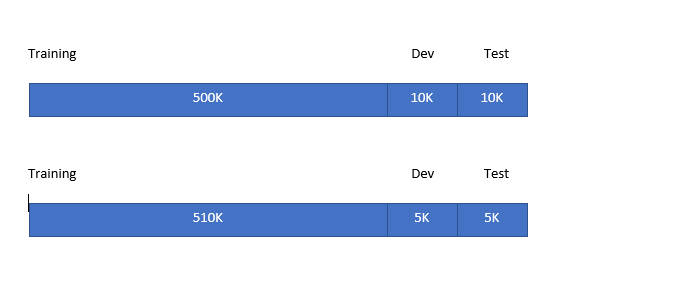

# Training and testing on different distributions

In a deep learning era, more and more teams are now training on data that comes from a different distribution than your dev and test sets. There are some best practices for dealing with when you're training and test distributions differ from each other.

## Cat mobile app example

Users will upload pictures taken from their cell phones, and you want to recognize whether the pictures that your users upload from the mobile app is a cat or not.

* Data from mobile app 10,000 samples
* Data from webpages 200,000 samples

You care about data from mobile app but the number of samples are not large. What can we do?

**Not Good Option**

Put everythiong together, randomly shuffle to train, dev, and test.

* Advantage: train, dev, and test distribution are the same.
* Huge disadvantage: Most of data for dev and test will be coming from webpages.

So this option is not good.

**Good Option**

* Training set inclucdes 205,000 images including 5000 images from app.
* Dev and test set includes 2,500 images from app

Disadvantage is that the distribution of training set is different from dev and test set.

## speech activated rearview mirror for a car

x=audio clip
y=transcript

|Training|Dev/test|
| --- | --- |
|Purchased data     | Speech activated rearview mirror    |
|Smart speaker control   |   |
|voice keyboard   |   |
|500,000 samples   | 20,000 samples  |

**Options**

