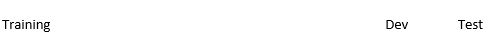
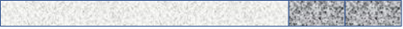
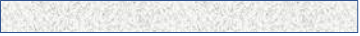
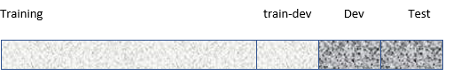
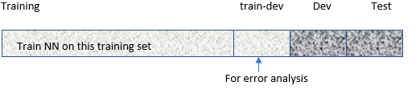
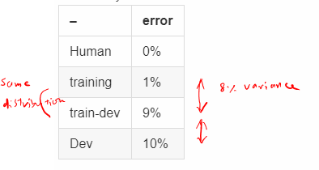
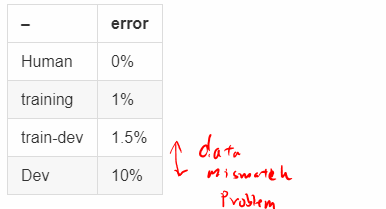
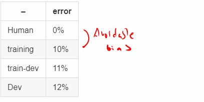
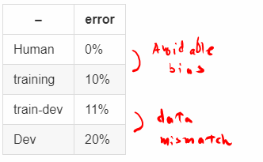
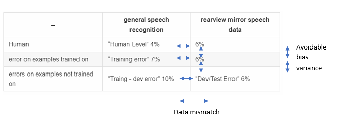

# Bias and Variance with mismatched data distributions

Estimating the bias and variance of your learning algorithm really helps you prioritize what to work on next. But the way you analyze bias and variance changes when your training set comes from a different distribution than your dev and test sets.

## Cat classifier example

| --       | error |
| -------- | ----- |
| Human    | 0%    |
| training | 1%    |
| dev         |10%       |

* If dev and training came from the **same distribution**, then we have a **large variance problem**.
* If dev and training came from the **different distribution**, then we have additional problems. Two things happend.
  1. Algorithm saw data in the traing set but did not see the data in dev set
  2. Dev set has different distribution

To examine, make a sub set of data.
* **Training-dev set**: same distribution as trainng set, but not used for training.

  - We started with following setup where the dev and test sets had the same distribution 
  
  

  - Randomly shuffle **training set** 
  
  - and create a **train-dev set** 
  

  So training and train-dev set have the same distribution, and dev and test have the same distribution.

  Now, new training set can be used for train NN, and train-dev is used for error analyis as shown below.

  

- Error analysis 1
| --       | error |
| -------- | ----- |
| Human    | 0%    |
| training | 1%    |
| train-dev|9%     |
| Dev      |10%    |

Now we have a variance problem

- Error analysis 2 

- Error analysis 3 

- Error analysis 4 

## General Principals on bias/variance on mismatched training and dev/test sets

## More general formulation
| --        | error |
| --------- | ----- |
| Human     | 4%    |
| training  | 7%    |
| train-dev | 10%   |
| Dev       | 6%    |
| Test      | 6%    |

| --                                | general speech recognition | rearview mirror speech data |
| --------------------------------- | -------------------------- | --------------------------- |
| Human                             | "Human Level" 4%           |      6%                       |
| error on examples trained on      | "Training error" 7%        |       6%                      |
| errors on examples not trained on | "Traing - dev error" 10%   |  "Dev/Test Error"  6%       |

How do you address data mismatch?
