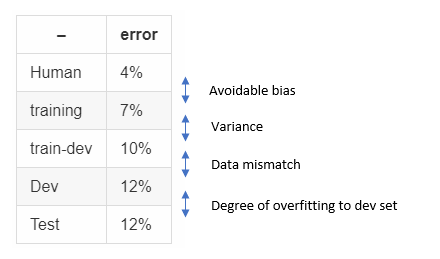
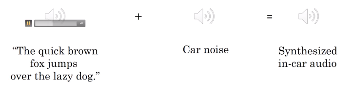
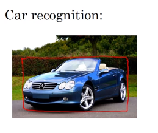

# Addressing data mismatch

If your training set comes from a different distribution, than your dev and test set, and if error analysis shows you that you have a data mismatch problem, what can you do?

* Carry out manual error analysis to try to understand difference between training and dev/test sets
  - example: dev set may be more noisy
  - Lookinto how the dev set differes from train-dev set.
* Make training data more similar; or collect more data similar to dev/test representations
  - Example: simulate noisy data for dev.
  - Example: artificial data synthestis

# Artificial data synthestis
**Example 1**

Let's say you have 10,000 hours of audio data and 1 hour of car noise
* you may overfit the model to 1 hour of car noise if you multiply 1 hr of car noise to 10,000 times.
* getting unique 10,000 car noise probably make the model more robust.

**Example 2**

You could use computer graphics to synthesize car pictures, but again this results in overfitting the model to the set of computer graphics.
