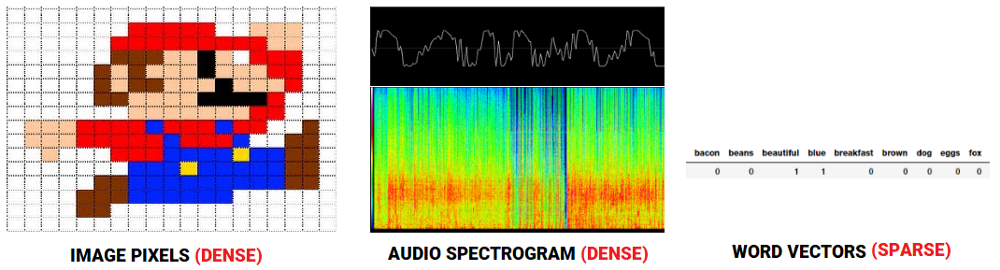
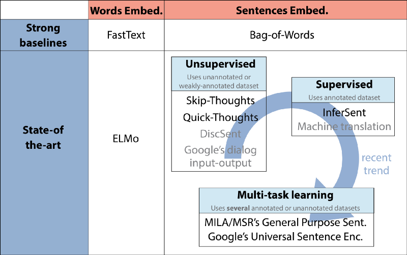
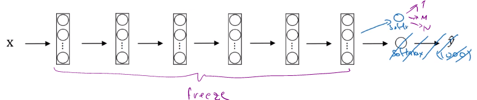
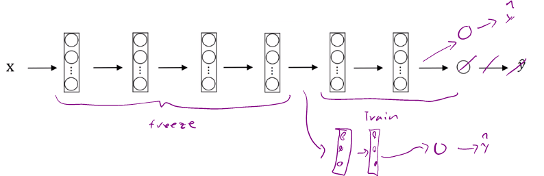
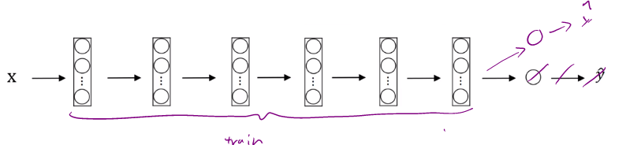

# Transfer learning

One of the most powerful ideas in deep learning is that sometimes you can take knowledge the neural network has learned from one task and apply that knowledge to a separate task. So for example, maybe you could have the neural network learn to recognize objects like cats and then use that knowledge or use part of that knowledge to help you do a better job reading x-ray scans. This is called transfer learning.

## Image recognition

* The NN was trained on cat pictures.
  - x= cat images
  - y= cat recognizer
* To transfer this for radiology diagnosis, you could simply swap the data.
  - x=radiology image,
  - y=diagnosis,
  - Then initialize the last output layer with new random weight parameters, and re-train on new data.

Sometimes the initial training on cat images are called "pre-training"

## Speech recognition
* Pretraining
    - x= audio clip
    - y= transcript

* A new task is to build wakeword.
  - You might take out the last layer of the neural network again and create a new output node
  - Create not just a single new output, but actually create several new layers to your neural network to try to put the labels Y for your wake word detection problem.
  - Depending on how much data you have, you might just retrain the new layers of the network or maybe you could retrain even more layers of this neural network.

## Natural language
We’ve had some recent successes with word embeddings including methods like [Word2Vec, GloVe and FastText](https://towardsdatascience.com/understanding-feature-engineering-part-4-deep-learning-methods-for-text-data-96c44370bbfa).

Following models will be discussed.

* Baseline Averaged Sentence Embeddings
* Doc2Vec
* Neural-Net Language Models (Hands-on Demo!)
* Skip-Thought Vectors
* Quick-Thought Vectors
* InferSent
* Universal Sentence Encoder

### Embeddings
>An embedding is a fixed-length vector typically used to encode and represent an entity (document, sentence, word, graph!)

With regard to speech or image recognition systems, we already get information in the form of rich dense feature vectors embedded in high-dimensional datasets like audio spectrograms and image pixel intensities. However, when it comes to raw text data, especially count-based models like Bag of Words, we are dealing with individual words, which may have their own identifiers, and do not capture the semantic relationship among words. This leads to huge sparse word vectors for textual data and thus, if we do not have enough data, we may end up getting poor models or even overfitting the data due to the curse of dimensionality.

Predictive methods like **Neural Network based language models** try to predict words from its neighboring words looking at word sequences in the corpus and in the process, it learns distributed representations, giving us dense word embeddings.

If we have a good numeric representation of text data which captures even the context and semantics, we can use it for a wide variety of downstream real-world tasks like sentiment analysis, text classification, clustering, summarization, translation and so on. The fact of the matter is, machine learning or deep learning models run on numbers, and embeddings are the key to encoding text data that will be used by these models.

A big trend here has been finding out so-called **Universal Embeddings** which are basically pre-trained embeddings obtained from training deep learning models on a huge corpus. This enables us to use these pre-trained (generic) embeddings in a wide variety of tasks including, scenarios with constraints like lack of adequate data. This is a perfect example of **transfer learning**, leveraging prior knowledge from pre-trained embeddings to solve a completely new task.

The following figure showcases some recent trends in Universal Word & Sentence Embeddings, from HuggingFace.

Recent Trends in Universal Word & Sentence Embeddings (Source: https://medium.com/huggingface/universal-word-sentence-embeddings-ce48ddc8fc3a)

### Trends in Word Embedding Models
The word embedding models are perhaps some of the older and more mature models which have been developed starting with Word2Vec in 2013. The three most common models leveraging deep learning (unsupervised approaches) models based on embedding word vectors in a continuous vector space based on semantic and contextual similarity are:

- Word2Vec
- GloVe
- FastText
-
These models are based on the principle of distributional hypothesis in the field of distributional semantics, which tells us that words which occur and are used in the same context, are semantically similar to one another and have similar meanings (‘a word is characterized by the company it keeps’).

Another interesting model in this area which has been developed recently, is **[ELMo](https://allennlp.org/elmo)**. This has been developed by the Allen Institute for Artificial Intelligence. ELMo is a take on the famous muppet character of the same name from the famed show, ‘Sesame Street’, but actually is an acronym which stands for ‘Embeddings from Language Models’.

Basically, ELMo gives us word embeddings which are learnt from a deep bidirectional language model (biLM), which is typically pre-trained on a large text corpus, enabling transfer learning for these embeddings to be used across different NLP tasks. Allen AI tells us that ELMo representations are contextual, deep and character-based which uses morphological clues to form representations even for OOV (out-of-vocabulary) tokens.

---

##When does transfer learning make sense?
Transfer learning makes sense when you have a lot of data for the problem you're transferring from and usually relatively less data for the problem you're transferring to.

**The first example:**

  if there are **1,000,000 cat images** ($X_{pre-training}$), and **100 radiology images** ($X_{new\_task}$).

**The Second example:**

if there are **10,000 hr of speech recognition** ($X_{pre-training}$), and **1 hr wakeword** ($X_{new\_task}$).

### Principal

#### Transfer from A to B
  * Task A and B have the same input x. (first example had images as input)
  * $m_{\text{Task A}}\ggg m_{\text{Task B}}$ .
  * Low level features from A could be helpful for learning B.

  ## Additional Notes on Transfer learning

  Example:

  Suppose we are building a model to identify your pets. We have three calss 1) Tigger, 2) Misty, and 3)Neither. We don't have a lot of pictures to train a model.

  ### What do we do if you have a small set of your own data?

  1) Start from open source neural network (download code and weights)
  2) Drop the softmax layer and create your own softmax classifier
  

  SOme of open source nn have parameters like `trainableparameter=0`, `freeze=1` where you can specify to train parameters at a particular layer.

  In the above example, we could train the last layer (softmax) and freeze the rest.

  To speed up the process, we could run the frozen components of the NN, and save the feature vectors of the last layer before softmax into a disk, then train a sharrow network.

  ## What do we do if you have a large set of your own data?

  Reduce the number of layers to freeze.
  

  
